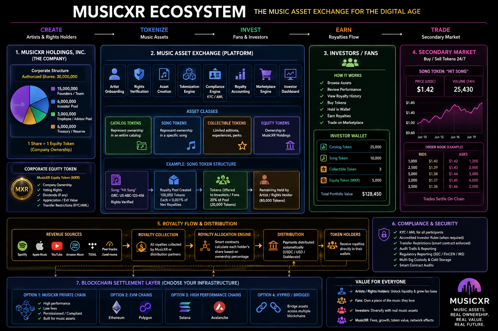

# MusicXR

MusicXR is a new platform concept for verified music asset ownership, royalty participation, and future compliant marketplace liquidity.

The current repository is a planning workspace. It contains the source business diagram and three long-form plans that define the product, technology, implementation sequence, and go-to-market path for the first build.



## Planning Status

Prepared: 2026-06-21

Current stage: pre-build planning for a brand new platform.

Primary recommendation:

> MusicXR should ship trust before it ships liquidity.

That means the first product should prove rights verification, asset intake, compliance-aware onboarding, beautiful asset discovery, admin review, ledger design, and royalty operations before promising broad secondary trading or public tokenized securities.

## Planning Documents

Start here:

- [MusicXR Platform Plan](plan-docs/MUSICXR_PLATFORM_PLAN.md) - product vision, user groups, core surfaces, rights model, asset/token model, royalty operations, compliance concerns, marketplace model, MVP scope, risks, and launch readiness.
- [MusicXR Technology Plan](plan-docs/MUSICXR_TECHNOLOGY_PLAN.md) - serverless Flutter/Firebase architecture, Firestore data model, security rules approach, Cloud Functions boundary, design system direction, vendor choices, CI/CD, testing, and app-store readiness.
- [MusicXR Implementation And Go-To-Market Plan](plan-docs/MUSICXR_IMPLEMENTATION_GTM_PLAN.md) - phased execution plan, team model, weekly operating cadence, MVP backlog, pilot strategy, launch audiences, GTM funnel, channel plan, metrics, risk register, and immediate next actions.
- [Source Business Diagram](plan-docs/business-doc.png) - original visual concept used to derive the platform model.

## Web Planning Portal

This repo includes a static planning portal for viewing the long-form plans in a browser.

Local preview:

```bash
npm run preview
```

Then open:

```text
http://localhost:5173
```

The source documents live in `plan-docs/`. The deployable copies live in `public/plan-docs/` and are generated with:

```bash
npm run docs:sync
```

Deploy to Firebase Hosting:

```bash
npm run deploy
```

Firebase is configured in `firebase.json` with standard Hosting pointed at `public/`. The existing App Hosting backend reference for `musicxr-production` is preserved in the same file.

## Platform Summary

MusicXR is envisioned as a music asset exchange and operating layer where:

- Artists and rights holders submit songs, catalogs, rights packages, collectibles, or future equity-linked assets.
- MusicXR verifies rights, structures assets, stores evidence, and prepares compliant offering data.
- Fans and qualified participants can discover approved music assets, join waitlists, review disclosures, and eventually participate in counsel-approved offerings.
- Royalty income can be imported, allocated, reported, and distributed through controlled payment or custody rails.
- Eligible assets may later support permissioned secondary transfers or marketplace liquidity after the legal, app-store, and partner structure is approved.

The product should not launch as a generic NFT marketplace. The stronger position is a trusted, compliance-aware music asset platform with fan-facing ownership experiences and investor-grade reporting.

## Core Users

- Artists and rights holders who want liquidity, fan alignment, and structured asset participation.
- Fans who want a deeper, more transparent relationship with music they care about.
- Qualified investors or participants who need clear disclosures, eligibility controls, and reporting.
- MusicXR operators who review rights, compliance, documents, royalties, payouts, and launch readiness.
- Legal, finance, and compliance partners who need audit trails and controlled workflows.

## Core Product Surfaces

The first platform should be organized around these surfaces:

- Public discovery and waitlist.
- Artist and rights-holder onboarding.
- Asset submission and document upload.
- Admin rights review console.
- Compliance and eligibility workflows.
- Approved asset pages.
- Purchase-intent or offering sandbox.
- Portfolio and statement dashboard.
- Royalty import and allocation console.
- Operations, support, and audit views.

## Technology Direction

The selected technology plan is:

- Client framework: Flutter.
- Client language: Dart.
- Backend platform: Firebase plus selected Google Cloud serverless products.
- Primary database: Cloud Firestore in native mode.
- Backend compute: Cloud Functions for Firebase in TypeScript.
- File storage: Cloud Storage for Firebase.
- Web hosting: Firebase Hosting.
- Identity: Firebase Authentication, with Identity Platform if needed.
- Protection: Firebase App Check, strict Firestore Security Rules, and strict Storage Rules.
- Analytics and reliability: Firebase Analytics, Crashlytics, Performance Monitoring, Remote Config, Cloud Logging, and BigQuery export.
- App-store builds: Codemagic.
- Firebase deployments: GitHub Actions.
- KYC/KYB: Persona.
- Payments and payouts: Stripe where legally appropriate.
- Documents and agreements: DocuSign.
- Search: Algolia when Firestore queries are not enough.
- Custody or on-chain infrastructure later: Fireblocks or a comparable regulated provider.

Key architectural rule:

> Clients may request actions, but Cloud Functions must execute trusted actions.

The Flutter app can submit intents and read approved views, but it should not directly write ledger events, KYC results, payment status, token balances, royalty allocations, transfer approvals, or admin audit records.

## Design Direction

MusicXR should feel like a premium music-finance product: emotionally connected to music, but calm enough for regulated asset decisions.

The design system should prioritize:

- Beautiful artist and asset presentation.
- Clear risk and eligibility language.
- High-trust dashboards.
- Legible royalty and performance charts.
- Strong mobile ergonomics.
- Responsive web support.
- Accessible color, typography, and interaction states.
- No crypto-dashboard clone aesthetic.

## Implementation Strategy

The implementation plan is organized around three big moves:

1. Build the platform spine.
2. Build verified asset supply.
3. Build demand before opening transactions.

The first release sequence should be:

1. Foundation: Flutter/Firebase project setup, environments, rules, design tokens, CI/CD, and app shell.
2. Supply intake: artist and rights-holder onboarding, asset drafts, document upload, and admin review.
3. Compliance: KYC/KYB integration path, investor eligibility model, audit records, and jurisdiction controls.
4. Asset demand capture: public discovery, approved asset pages, artist-specific waitlists, and education content.
5. Offering sandbox: purchase intent, ledger simulation, disclosure flows, and legal review gates.
6. Royalty operations: imports, allocation preview, statements, distribution batches, and finance review.
7. Private beta: limited artists, limited users, support workflows, monitoring, and operational runbooks.
8. Public launch readiness: app-store submissions, review notes, legal signoff, and support coverage.

## MVP Scope

The MVP should include:

- Authenticated accounts.
- Artist and rights-holder profiles.
- Asset submission workflow.
- Rights document storage.
- Admin review queues.
- Asset registry.
- Public asset pages.
- Waitlist and interest capture.
- Compliance onboarding structure.
- Purchase-intent or offering sandbox.
- Royalty import prototype.
- Portfolio or statement preview.
- Audit logging.
- Basic support and operations workflow.

The MVP should exclude:

- Public secondary trading.
- 24/7 order book.
- External wallet transfers.
- Public tokenized securities without counsel-approved structure.
- Fully automated royalty distributions before finance review.
- Complex catalog tokenization before one or two simple asset types are proven.

## Go-To-Market Strategy

The launch path should begin before financial transactions:

- Recruit 5 to 10 clean-rights pilot artists or rights holders.
- Recruit 250 to 1,000 waitlisted fans and qualified participants through those artists and targeted communities.
- Launch a beautiful web experience that explains MusicXR clearly.
- Build trust through verified rights, transparent risk language, artist stories, and platform education.
- Keep public claims review-gated until legal structure is approved.

Primary positioning:

> A verified music asset platform for rights holders, fans, and qualified participants, built to make music ownership, royalty participation, and future compliant liquidity more transparent.

Audience sequence:

1. Rights holders with clean, compelling assets.
2. Artist-led fan audiences.
3. Qualified investor or participant cohorts.
4. Strategic partners in distribution, rights administration, compliance, and custody.

## Compliance And Launch Notes

MusicXR touches music rights, securities-like participation, payments, custody, tax, app-store policy, KYC/KYB, AML, and potentially blockchain settlement.

Before any public investment, token sale, royalty participation sale, secondary transfer, custody feature, or marketplace launch, the model needs counsel-approved structure and partner review.

The plans currently recommend launching app stores first with education, account access, artist submissions, portfolio or statement viewing, and approved non-transactional surfaces. Investment purchases, token trading, crypto custody, and secondary market features should be added only after licensing, partner structure, jurisdiction controls, and app review materials are ready.

## Immediate Next Actions

The implementation/GTM plan recommends starting with:

1. Choose legal structure for first pilot offering.
2. Choose first asset type.
3. Choose first market/jurisdiction.
4. Choose whether the first pilot is transactional or waitlist-only.
5. Confirm Firebase project and Flutter app naming.
6. Create the first design moodboard and product sitemap.
7. Draft the artist intake checklist.
8. Draft the rights-review checklist.
9. Start outreach to 50 artist/rights-holder prospects.
10. Build the first 30-day sprint board from the implementation plan.

## Repository Map

```text
.
├── README.md
└── plan-docs
    ├── MUSICXR_PLATFORM_PLAN.md
    ├── MUSICXR_TECHNOLOGY_PLAN.md
    ├── MUSICXR_IMPLEMENTATION_GTM_PLAN.md
    └── business-doc.png
```

## Important Disclaimer

The planning documents are product and implementation strategy artifacts, not legal, financial, securities, tax, or investment advice. MusicXR should not offer tokenized ownership, royalty participation, secondary trading, custody, or investment products until qualified counsel and regulated partners have approved the structure.
