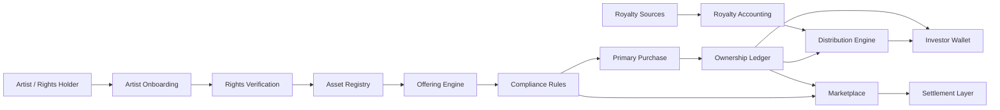

# MusicXR Platform Plan

Source artifact: `business-doc.png`  
Planning status: first-pass platform plan for a brand new product build  
Prepared: 2026-06-21  

## 1. Executive Summary

MusicXR is envisioned as a music asset exchange for the digital age: a platform where artists and rights holders can create tokenized music assets, fans and investors can buy or hold exposure to those assets, royalty income can be tracked and distributed, and eligible token holders can trade qualified assets on a secondary market.

The concept in `business-doc.png` describes a full ecosystem:

- Artists and rights holders create verified music assets.
- MusicXR tokenizes those assets into catalog tokens, song tokens, collectible tokens, and equity tokens.
- Fans and investors review asset performance, buy tokens, hold them in a wallet, earn royalties, and trade eligible tokens.
- Royalties are collected from music revenue sources, allocated by ownership percentage, and distributed through wallet or payment rails.
- Compliance, KYC/AML, transfer restrictions, audit trails, reporting, custody, and smart contract audits are core to the model.
- Blockchain settlement may use a private MusicXR chain, EVM chains, high-performance chains, or a hybrid/bridged approach.

The most important planning conclusion is that MusicXR should not be built as a generic NFT marketplace. The image describes a regulated financial and rights-management platform. The winning product shape is closer to a compliant private-market music asset exchange with fan-facing ownership features, royalty accounting, investor dashboards, and carefully controlled secondary liquidity.

This document treats the diagram as a product thesis, not as legal advice. Before any public token offering, securities counsel, music rights counsel, payments counsel, and tax counsel should validate the model.

## 2. Vision

MusicXR helps music rights holders unlock liquidity while giving fans and investors a transparent way to participate in the economic life of music assets.

The product should make music assets feel inspectable, trustworthy, and alive:

- Artists can transform songs, catalogs, and experiences into structured asset offerings.
- Fans can own a meaningful stake or collectible connection to music they love.
- Investors can evaluate royalty performance, risk, and liquidity in a specialized music market.
- Rights holders retain upside while selectively selling portions of future royalty streams.
- MusicXR earns platform fees, marketplace fees, servicing fees, and potentially appreciation in its own equity/token ecosystem.

The core promise should be stated carefully:

> MusicXR provides compliant infrastructure for verified music asset ownership, royalty participation, and marketplace liquidity.

The platform should avoid vague "get rich from music" language. The product can be ambitious while keeping all user-facing claims grounded in verified rights, verified cash flow, clear risk disclosures, and regulated transfer controls.

## 3. What The Source Image Specifies

The image is organized around a five-stage ecosystem:

1. Create: artists and rights holders contribute music assets.
2. Tokenize: MusicXR converts rights-backed music assets into structured tokens.
3. Invest: fans and investors buy and hold tokens.
4. Earn: royalties flow through accounting and distribution infrastructure.
5. Trade: eligible tokens can trade on a secondary market.

The image identifies MusicXR Holdings, Inc. as the company layer and a Music Asset Exchange as the platform layer.

The company-side structure shown in the image:

- Authorized shares: 30,000,000.
- Founders/team allocation: 15,000,000.
- Investor pool: 6,000,000.
- Employee/advisor pool: 3,000,000.
- Treasury/reserve: 6,000,000.
- Proposed mapping: 1 share equals 1 equity token.
- Corporate equity token: MusicXR Equity Token, shown as `MXR`.
- Equity token rights shown: company ownership, voting rights, dividends if any, appreciation/exit value, and transfer restrictions through KYC/AML.

The platform-side modules shown in the image:

- Artist onboarding.
- Rights verification.
- Asset creation.
- Tokenization engine.
- Compliance engine with KYC/AML.
- Royalty accounting.
- Marketplace engine.
- Investor dashboard.

The asset classes shown in the image:

- Catalog tokens: represent ownership in an entire catalog.
- Song tokens: represent ownership in a specific song.
- Collectible tokens: limited editions, experiences, and perks.
- Equity tokens: ownership in MusicXR Holdings.

The example song token structure shown in the image:

- Song: "Hit Song".
- ISRC: `US-ABC-123-456`.
- Rights verified.
- Royalty pool: 100,000 tokens.
- Each token: 0.001 percent of net royalties.
- Offered to investors/fans: 20 percent of pool, or 20,000 tokens.
- Retained by artist/rights holder: 80 percent of pool, or 80,000 tokens.

The investor/fan flow shown in the image:

- Browse assets.
- Review performance.
- View royalty history.
- Buy tokens.
- Hold in wallet.
- Earn royalties.
- Trade on marketplace.

The secondary market concept shown in the image:

- 24/7 buy/sell.
- Price shown in USDC.
- 24-hour volume.
- Price chart.
- Order book.
- On-chain settlement.

The royalty flow shown in the image:

- Revenue sources include Spotify, Apple Music, YouTube, Amazon Music, TIDAL, PeerTracks, and others.
- MusicXR or distribution partners collect royalties.
- A royalty allocation engine calculates each holder's share by ownership percentage.
- Payments are distributed automatically in USDC, USD, or stablecoin.
- Token holders receive royalties in their wallets.

The compliance and security requirements shown in the image:

- KYC/AML for all participants.
- Accredited investor rules when required.
- Transfer restrictions enforced by smart contracts.
- Audit trails and reporting.
- Regulatory reporting for SEC, FinCEN, and IRS obligations.
- Multi-signature custody and cold storage.
- Smart contract audits.

The blockchain options shown in the image:

- MusicXR private chain: high performance, low fees, permissioned/compliant, built for music assets.
- EVM chains: Ethereum and Polygon.
- High-performance chains: Solana and Avalanche.
- Hybrid/bridged approach: bridge assets across multiple blockchains.

The value proposition shown in the image:

- Artists and rights holders unlock liquidity and grow their fan base.
- Fans own a piece of music they love.
- Investors diversify with real music assets.
- MusicXR earns fees, growth, token value, and network effects.

## 4. Strategic Positioning

MusicXR should be positioned as a music asset infrastructure company, not only as a consumer marketplace.

The defensible core is a combination of:

- Rights verification.
- Royalty data ingestion.
- Asset structuring.
- Compliance-aware transfer control.
- Investor-grade disclosures.
- Fan-accessible ownership experiences.
- Marketplace liquidity once legally available.

The platform should compete on trust and specialization. General crypto marketplaces can list tokens, but they do not usually solve chain-of-title, music royalty reconciliation, investor suitability, securities exemptions, tax reporting, rights-holder servicing, or long-term royalty distribution. Those are the hard parts, and they are also the moat.

## 5. Product Principles

1. Compliance first.
   No asset should be sellable until rights, offering rules, KYC/AML, and transfer restrictions are validated.

2. Rights before tokens.
   Tokenization should be the final representation of an already verified asset package, not a shortcut around legal or royalty complexity.

3. Cash flow transparency.
   Investors and fans should see historical royalty data, forecast assumptions, distribution rules, fees, and risk factors before purchase.

4. Different users need different experiences.
   Artists need onboarding and liquidity tools. Fans need clarity and emotional connection. Investors need diligence, reporting, and portfolio tools. Admins need controls.

5. On-chain where it helps, off-chain where it must.
   Ownership settlement and transfer restrictions may benefit from blockchain rails. Rights evidence, KYC data, tax records, royalty calculations, and regulatory records need controlled off-chain systems.

6. Start permissioned.
   The initial platform should use permissioned access, curated assets, and limited offerings before broader public marketplace mechanics.

7. Treat secondary trading as a later milestone.
   Marketplace liquidity is central to the long-term thesis, but it is also one of the most regulated and operationally complex features.

## 6. Primary User Groups

### Artists And Rights Holders

Artists and rights holders are the supply side. They bring songs, catalogs, and fan experiences into the platform.

Primary needs:

- Create an account and complete identity verification.
- Prove rights ownership or authorization.
- Upload asset metadata.
- Connect royalty statements or distributor data.
- Define how much royalty participation to offer.
- Keep a retained stake.
- Monitor sales, token holder base, and royalty distributions.
- Communicate with fan-investors where allowed.

Key trust concern:

- The platform must not let an artist tokenize rights they do not own or cannot legally assign.

### Fans

Fans are emotionally motivated buyers who may want ownership, perks, collectibles, and participation in an artist's growth.

Primary needs:

- Discover artists and songs they care about.
- Understand what a token actually provides.
- Buy safely with clear risk disclosures.
- Hold assets in a simple wallet.
- Receive royalties or perks.
- Track ownership and value without needing advanced crypto knowledge.

Key trust concern:

- Fans must not be pushed into investment behavior they do not understand.

### Investors

Investors evaluate music assets as alternative assets and care about yield, risk, liquidity, reporting, and diversification.

Primary needs:

- Review historical royalty performance.
- Compare asset classes and risk tiers.
- Understand contractual rights and restrictions.
- Build a portfolio across songs and catalogs.
- Receive distributions.
- Export reports.
- Trade eligible assets if allowed.

Key trust concern:

- Investors need credible data and disclosures, not promotional claims.

### MusicXR Admin And Operations Team

The internal team manages supply, compliance, rights verification, asset approvals, royalty operations, and marketplace health.

Primary needs:

- Review onboarding submissions.
- Verify rights documents.
- Approve or reject asset listings.
- Configure offering restrictions.
- Monitor KYC/AML states.
- Reconcile royalty payments.
- Manage disputes and support tickets.
- Generate audit and reporting packages.

Key trust concern:

- Admin actions must be auditable, permissioned, and reversible where business rules allow.

### Compliance, Legal, And Finance Operators

This group may include internal staff, external counsel, accounting partners, broker-dealer or funding portal partners, and tax/reporting vendors.

Primary needs:

- Review asset offering structure.
- Maintain investor eligibility rules.
- Enforce transfer restrictions.
- Review suspicious activity signals.
- Prepare SEC, FinCEN, IRS, and state-level reporting where applicable.
- Maintain custody and funds-flow controls.

Key trust concern:

- The platform must support defensible records and configurable controls, not one-off manual spreadsheet work.

## 7. Core Platform Surfaces

### Public Discovery Surface

Purpose:

- Present MusicXR as a credible music asset platform.
- Explain the model without promising guaranteed returns.
- Show curated artists, songs, and catalogs.
- Drive users into signup, KYC, artist application, or waitlist flows.

Early features:

- Home page.
- Asset browsing teaser.
- Artist application.
- Investor/fan waitlist.
- Education hub.
- Risk and compliance overview.

Later features:

- Public asset pages with partial data.
- Public marketplace snapshots.
- Artist campaign pages.
- Fan-community updates.

### Artist Portal

Purpose:

- Let artists and rights holders submit assets for verification and tokenization.

Early features:

- Artist profile.
- Rights holder profile.
- KYC/KYB intake.
- Asset submission form.
- Rights document upload.
- ISRC and metadata entry.
- Royalty statement upload or integration intake.
- Offering preference form.
- Review status tracking.

Later features:

- Distributor integrations.
- Catalog import.
- Automated royalty analytics.
- Campaign builder.
- Token holder communications.
- Revenue and distribution dashboards.

### Asset Review Console

Purpose:

- Give MusicXR operators a controlled workflow for reviewing and approving assets.

Early features:

- Submission queue.
- Rights document checklist.
- Metadata verification.
- Royalty history review.
- Approval notes.
- Rejection reasons.
- Internal risk rating.
- Audit log.

Later features:

- Automated rights confidence scoring.
- Third-party rights database checks.
- Distributor API reconciliation.
- Counsel review workflow.
- Multi-approver release process.

### Investor And Fan App

Purpose:

- Let users browse, evaluate, purchase, hold, and monitor eligible music assets.

Early features:

- Signup and KYC.
- Browse approved assets.
- Asset detail pages.
- Risk disclosures.
- Purchase flow.
- Portfolio dashboard.
- Wallet balance display.
- Royalty distribution history.

Later features:

- Watchlists.
- Portfolio analytics.
- Tax document exports.
- Secondary market trading.
- Social/fan perks.
- Artist updates.

### Marketplace And Trading Surface

Purpose:

- Enable eligible buy/sell activity for qualified tokens under applicable legal and transfer rules.

Early features:

- Primary offering purchase flow.
- Eligibility-gated access.
- Transfer restriction checks.
- Settlement record.
- Order intent capture, if counsel approves.

Later features:

- Order book.
- Price charts.
- Bid/ask depth.
- Trade history.
- Secondary transfer approvals.
- Market surveillance.
- Circuit breakers or admin trading pauses.

### Royalty Operations Console

Purpose:

- Ingest royalty income, reconcile sources, calculate allocations, and distribute payments.

Early features:

- Royalty source management.
- Statement upload.
- Revenue line item import.
- Asset-level allocation.
- Holder cap table snapshots.
- Distribution batch preview.
- Payment status tracking.

Later features:

- Distributor integrations.
- Automated revenue matching.
- Stablecoin distribution.
- Fiat payout rails.
- Tax withholding logic.
- Dispute workflows.

### Compliance Console

Purpose:

- Centralize identity, eligibility, transfer, audit, and reporting controls.

Early features:

- KYC/KYB status.
- Investor accreditation status where applicable.
- Country and state restrictions.
- Sanctions and AML vendor status.
- Transfer restriction matrix.
- Audit log search.
- Manual hold or freeze controls.

Later features:

- Suspicious activity workflows.
- SEC exemption reporting packages.
- IRS reporting export.
- Broker or transfer-agent integration.
- FinCEN-related reporting workflow if money services obligations apply.

## 8. Asset And Token Model

MusicXR should treat each tokenized music asset as a structured product with strict metadata, legal terms, and entitlement rules.

### Asset Types

Catalog asset:

- Represents a bundle of songs or rights interests.
- Best for larger investors and rights holders with meaningful historical royalty data.
- Requires detailed track-level metadata and revenue allocation logic.

Song asset:

- Represents a single song or recording/composition royalty stream.
- Best for fan-facing offerings and easier storytelling.
- Requires clear ISRC/ISWC metadata, rights splits, and revenue-source definitions.

Collectible asset:

- Represents perks, access, experiences, digital memorabilia, or limited fan benefits.
- May be designed as a non-royalty asset to reduce securities complexity, but this must be reviewed.
- Best for community building and artist engagement.

Equity asset:

- Represents ownership in MusicXR Holdings or an affiliated entity.
- Most clearly securities-like and should be handled through counsel-approved offering and transfer mechanics.

### Token Design Questions

Every token class needs answers to these questions before launch:

- What legal right does the token represent?
- Is the token a security?
- Who is the issuer?
- What exemption or registration path applies?
- Who may buy it?
- What transfer restrictions apply?
- Does it pay royalties, dividends, perks, or nothing?
- Does it carry voting rights?
- What fees are deducted before distribution?
- What happens if royalty data is delayed or disputed?
- What happens if the artist's rights are challenged?
- Can tokens be redeemed, retired, or frozen?
- Can a holder self-custody, or must custody remain platform-controlled?

### Recommended Initial Asset Strategy

The first real product should avoid launching all four asset classes at once.

Recommended sequence:

1. Start with non-tradable collectible/fan access pilots to validate onboarding, wallet UX, artist demand, and fan appetite.
2. Add rights-verified royalty participation assets in a private or limited-access pilot.
3. Add compliant primary offerings for catalog/song royalty tokens.
4. Add secondary trading only after transfer rules, broker/ATS/funding portal strategy, and market surveillance are ready.
5. Add MusicXR equity token only after corporate, securities, transfer-agent, tax, and custody decisions are settled.

This sequence preserves the full vision while reducing early regulatory and operational blast radius.

## 9. Rights Verification Model

Rights verification is the foundation of the platform.

A MusicXR asset should not be tokenized until the platform can answer:

- Who owns the master rights?
- Who owns the publishing/composition rights?
- Which royalty streams are included?
- Which royalty streams are excluded?
- Are there existing liens, advances, recoupment obligations, label restrictions, publisher restrictions, or distributor restrictions?
- Can the rights holder legally assign or share the relevant economic interest?
- Are there co-writers, producers, samples, featured artists, or neighboring rights claims?
- Are there territory limits?
- Are there term limits?
- Are royalties already pledged elsewhere?

### Required Rights Evidence

For each asset, the platform should collect:

- Artist or rights holder identity.
- Entity documents for companies.
- ISRC and ISWC where applicable.
- Distributor statements.
- PRO statements where applicable.
- Label, publisher, administration, or distribution agreements.
- Split sheets or writer share documentation.
- Chain-of-title documents.
- Any existing financing or royalty advance documents.
- Signed authorization to tokenize and administer the relevant economic interest.

### Rights Review Statuses

Suggested workflow:

- Draft: rights holder has started submission.
- Submitted: all required forms are present.
- In review: MusicXR operations is reviewing the file.
- Needs information: gaps or contradictions exist.
- Counsel review: legal review required.
- Verified: asset may proceed to structuring.
- Rejected: asset cannot proceed.
- Suspended: asset was previously verified but is paused due to dispute or new information.

## 10. Royalty Accounting And Distribution

The royalty engine is the operational heart of MusicXR.

### Royalty Sources

The image lists Spotify, Apple Music, YouTube, Amazon Music, TIDAL, PeerTracks, and others. In practice, MusicXR should support multiple revenue-source types:

- Distributor streaming royalties.
- Label royalties.
- Publishing royalties.
- PRO performance royalties.
- Mechanical royalties.
- Synchronization income.
- Neighboring rights income.
- Direct platform or fan revenue.
- Other contract-defined royalty streams.

Each asset must define exactly which revenue streams are included.

### Royalty Calculation

For each distribution period:

1. Import source statements.
2. Normalize revenue by asset, track, period, territory, currency, and source.
3. Deduct contractually allowed fees, reserves, chargebacks, taxes, or recoupment amounts.
4. Calculate net distributable royalties.
5. Snapshot eligible token holders as of the record date.
6. Allocate distributions by ownership percentage.
7. Generate a distribution batch.
8. Run compliance and payment checks.
9. Distribute via fiat, stablecoin, or wallet credit.
10. Publish holder statements.

### Royalty Ledger Requirements

The royalty ledger should be immutable from a product perspective, even if technical corrections are allowed through reversing entries.

Each entry should include:

- Asset ID.
- Source.
- Period.
- Gross amount.
- Deductions.
- Net amount.
- Currency.
- FX rate if applicable.
- Token holder snapshot ID.
- Allocation rule.
- Distribution batch ID.
- Payment rail.
- Status.
- Audit metadata.

### Distribution States

Suggested states:

- Imported.
- Needs review.
- Reconciled.
- Approved.
- Batch created.
- Compliance hold.
- Payment processing.
- Paid.
- Failed.
- Corrected.
- Disputed.

## 11. Marketplace Model

The source image shows a 24/7 secondary market with USDC pricing, volume, charts, order book, and on-chain settlement.

That is a compelling long-term destination. It should be planned as a regulated market system from day one, but not necessarily launched on day one.

### Primary Market

Primary offerings are the first buy-side experience.

Core requirements:

- Asset page.
- Offering terms.
- Eligibility check.
- Risk disclosure acknowledgement.
- Payment flow.
- Token allocation.
- Settlement receipt.
- Holder statement.
- Cooling-off or cancellation rules if required by offering path.

### Secondary Market

Secondary trading requires:

- Transfer eligibility checks for seller and buyer.
- Holding-period rules.
- Jurisdiction restrictions.
- Accredited investor checks where applicable.
- Order matching rules.
- Market data.
- Trade settlement.
- Custody or wallet controls.
- Surveillance for manipulation.
- Admin pause controls.
- Tax reporting.
- Records retention.

### Marketplace Implementation Recommendation

Build marketplace infrastructure in layers:

1. Internal transfer ledger.
2. Primary purchase settlement.
3. Transfer restriction service.
4. Admin-approved secondary transfers.
5. Request-for-quote or bulletin-board model if counsel approves.
6. Full order book only after regulatory path is validated.

This preserves optionality. The UI can eventually look like the image, but the legal structure should determine how quickly trading becomes real-time and continuous.

## 12. Compliance And Regulatory Planning

MusicXR sits at the intersection of securities, music rights, money movement, tax reporting, custody, consumer protection, and potentially money transmission.

The platform should be built with the assumption that many royalty-bearing and equity-like tokens may be securities or security-like instruments. The exact treatment depends on facts, structure, marketing, purchaser rights, and transfer mechanics.

### Legal And Compliance Workstreams

Securities:

- Determine whether each asset class is a security.
- Determine offering path: registered, Regulation D, Regulation CF, Regulation A, private placement, or another counsel-approved structure.
- Define investor eligibility and investment limits.
- Define resale restrictions and transfer controls.
- Decide whether broker-dealer, funding portal, transfer agent, ATS, or other regulated partners are required.

Music rights:

- Validate chain of title.
- Define assigned or participated royalty streams.
- Draft rights holder agreements.
- Draft token holder terms.
- Define dispute and clawback rules.

KYC/AML and money movement:

- Determine whether MusicXR or partners have money services business obligations.
- Select KYC/KYB, sanctions, and AML vendors.
- Define payment flows and custody responsibilities.
- Maintain suspicious activity review processes where applicable.

Tax:

- Treat digital assets as taxable property where applicable.
- Track cost basis, proceeds, distributions, withholding, and tax forms.
- Determine holder reporting, issuer reporting, and platform reporting obligations.

Custody:

- Determine whether MusicXR custodies tokens, cash, stablecoins, private keys, or only coordinates records.
- Design multi-signature controls.
- Define cold storage policies.
- Define recovery and account compromise procedures.

Privacy and data security:

- Protect identity documents, financial data, tax IDs, wallet addresses, rights contracts, and payment data.
- Separate public asset data from private compliance records.
- Implement role-based access and audit logs from the start.

### Current Official Reference Anchors

These links are included as planning anchors, not as final legal analysis:

- SEC digital asset securities analysis page, noting that the prior 2019 framework has been withdrawn and superseded by newer 2026 SEC guidance: https://www.sec.gov/about/divisions-offices/division-corporation-finance/framework-investment-contract-analysis-digital-assets
- SEC Regulation Crowdfunding overview: https://www.sec.gov/resources-small-businesses/exempt-offerings/regulation-crowdfunding
- FinCEN guidance on convertible virtual currency business models: https://www.fincen.gov/resources/statutes-regulations/guidance/application-fincens-regulations-certain-business-models
- IRS digital assets overview: https://www.irs.gov/filing/digital-assets

### Product Impact Of Compliance

Compliance should be expressed as product rules:

- Users cannot buy before KYC is complete.
- Certain assets are hidden or blocked by jurisdiction.
- Certain offerings are available only to eligible investors.
- Transfer restrictions are enforced before orders can be placed.
- Secondary trading may be unavailable during required holding periods.
- Royalty distributions can be held if identity, sanctions, tax, or payment status changes.
- Admins can pause an asset if rights are disputed.
- Every material user acknowledgement is recorded.

## 13. Security Model

Security must cover application security, wallet security, custody security, smart contract security, and operational controls.

### Application Security

Baseline requirements:

- Role-based permissions.
- Admin MFA.
- User MFA for financial actions.
- Strong session management.
- Audit logs for admin actions.
- Immutable financial-event logs.
- Webhook signature validation.
- File upload scanning.
- Secure document storage.
- Least-privilege access to identity and rights files.

### Wallet And Custody Security

Possible custody models:

- Fully custodial: simpler UX, higher regulatory and operational burden.
- Non-custodial: user controls keys, harder support and transfer enforcement.
- Hybrid: platform-controlled compliance ledger with user-facing wallet abstraction.

Recommended starting point:

- Use an abstracted wallet model for MVP.
- Keep assets non-transferable outside platform until counsel and technical controls approve external transfers.
- Use a custody or wallet infrastructure provider rather than custom key management.
- Keep on-chain minting optional until the first compliant asset structure is validated.

### Smart Contract Security

Before on-chain settlement:

- Write formal token behavior specs.
- Implement transfer restrictions.
- Support pause/freeze controls.
- Support issuer/admin roles with multi-signature governance.
- Use upgradeability only if governance and disclosures are clear.
- Run internal review.
- Run independent audit.
- Run testnet pilots.

## 14. Blockchain Settlement Strategy

The image presents four options. The right decision depends on compliance, liquidity, cost, user experience, partner ecosystem, and asset interoperability.

### Option 1: MusicXR Private Chain

Pros:

- Maximum control over permissioning.
- Lower fees.
- Easier compliance gating.
- Predictable transaction costs.
- Purpose-built music asset model.

Cons:

- Lower external liquidity.
- More infrastructure burden.
- Harder user trust if the chain is too centralized.
- Bridge complexity later.

Best use:

- Permissioned ledger for early regulated assets and internal settlement.

### Option 2: EVM Chains

Pros:

- Mature tooling.
- Strong wallet and custody support.
- Broad developer ecosystem.
- Easier smart contract audits.
- Potential compatibility with Ethereum and Polygon.

Cons:

- Public-chain compliance complexity.
- Gas volatility depending on chain.
- Public visibility may reveal sensitive holder behavior.

Best use:

- Later public or semi-public settlement once token rules and transfer restrictions are mature.

### Option 3: High-Performance Chains

Pros:

- Lower fees and high throughput.
- Consumer-scale transaction capacity.
- Potentially better UX for frequent activity.

Cons:

- Different tooling and security assumptions.
- More specialized development.
- Compliance integrations may be less mature depending on provider choices.

Best use:

- Later high-volume marketplace activity if ecosystem partners support compliance needs.

### Option 4: Hybrid Or Bridged

Pros:

- Supports multiple ecosystems.
- Avoids one-chain dependency.
- Can separate permissioned issuance from public liquidity.

Cons:

- Bridges increase risk.
- Compliance rules become harder across chains.
- Support complexity increases.

Best use:

- Later expansion after product-market fit and regulatory architecture are stable.

### Recommended Path

Start with an off-chain authoritative ledger plus optional permissioned on-chain settlement.

Phase 1 should not require public blockchain settlement. The platform can still be "tokenized" in a product and accounting sense while legal structure, rights verification, KYC, payment flows, and royalty allocation are validated. Once the core business works, MusicXR can decide whether to mint on a private chain, Polygon, Ethereum, Solana, Avalanche, or a hybrid model.

## 15. Technical Architecture

### High-Level System

### Core Services

Identity service:

- User accounts.
- Roles.
- MFA.
- KYC/KYB vendor integration.
- Accreditation status.
- Tax profile.

Rights service:

- Asset submissions.
- Rights document storage.
- Verification workflow.
- Counsel review.
- Rights status and dispute state.

Asset registry:

- Songs.
- Catalogs.
- Collectibles.
- Equity instruments.
- Metadata.
- Revenue stream definitions.
- Tokenization rules.

Offering service:

- Offering terms.
- Eligibility rules.
- Investment limits.
- Disclosure acknowledgement.
- Order/purchase workflow.
- Allocation logic.

Ownership ledger:

- Token balances.
- Holder snapshots.
- Transfer restrictions.
- Cap table views.
- Ledger events.

Royalty service:

- Statement imports.
- Revenue normalization.
- Deductions.
- Allocation.
- Distribution batches.
- Holder statements.

Marketplace service:

- Listings.
- Orders or transfer requests.
- Price history.
- Order book if approved.
- Trade settlement.
- Market surveillance.

Payment service:

- Fiat payments.
- Stablecoin payments.
- Payouts.
- Failed payment handling.
- Reconciliation.

Compliance service:

- Rule engine.
- Jurisdiction restrictions.
- Transfer restrictions.
- Audit logs.
- Reporting exports.
- Holds and freezes.

Notification service:

- Email.
- In-app notifications.
- Compliance notices.
- Distribution statements.
- Offering updates.

Admin console:

- Operational workflow.
- Review queues.
- Approvals.
- Audit views.
- Reporting.

### Suggested Initial Stack

Because the repo currently contains only the image, the stack is open. A conservative initial web platform stack would be:

- Backend: Laravel, Rails, Django, or Node/NestJS.
- Database: PostgreSQL.
- Queue: Redis or managed queue.
- File storage: S3-compatible private buckets.
- Frontend: React/Next.js or Laravel/Livewire depending on desired velocity.
- Payments: Stripe or equivalent for fiat MVP, plus a stablecoin provider later.
- KYC/KYB: Persona, Alloy, Sardine, Trulioo, or similar vendor.
- Wallet/custody: Fireblocks, Coinbase Developer Platform, Magic, Privy, or similar vendor after custody model selection.
- Analytics: PostHog, Segment, or warehouse-native tracking.
- Audit/event logging: append-only event table plus external log retention.

Architecture should be modular even in a monolith. The first build can be a well-organized monolith with clear service boundaries rather than microservices.

## 16. Data Model Sketch

Core entities:

- `users`
- `profiles`
- `identity_checks`
- `investor_profiles`
- `artist_profiles`
- `rights_holder_entities`
- `assets`
- `asset_tracks`
- `asset_rights_claims`
- `rights_documents`
- `rights_reviews`
- `token_classes`
- `token_pools`
- `offerings`
- `offering_documents`
- `eligibility_rules`
- `orders`
- `ownership_ledger_entries`
- `holder_snapshots`
- `royalty_sources`
- `royalty_imports`
- `royalty_line_items`
- `royalty_allocations`
- `distribution_batches`
- `distribution_payments`
- `market_listings`
- `trade_orders`
- `trade_executions`
- `wallet_accounts`
- `payment_accounts`
- `compliance_events`
- `admin_audit_events`
- `support_cases`

### Asset Entity

Minimum fields:

- ID.
- Asset type.
- Title.
- Artist name.
- Rights holder.
- ISRC/ISWC where applicable.
- Description.
- Artwork.
- Territories.
- Included royalty streams.
- Excluded royalty streams.
- Rights status.
- Offering readiness status.
- Public visibility.
- Risk rating.
- Created by.
- Approved by.
- Timestamps.

### Offering Entity

Minimum fields:

- Asset ID.
- Issuer.
- Token class.
- Total token supply.
- Tokens offered.
- Tokens retained.
- Price.
- Currency.
- Minimum purchase.
- Maximum purchase.
- Start and end dates.
- Eligibility rule set.
- Transfer restriction rule set.
- Disclosure package.
- Status.

### Ownership Ledger Entry

Minimum fields:

- Holder ID.
- Asset ID.
- Token class ID.
- Quantity delta.
- Event type.
- Source transaction.
- Settlement reference.
- Effective timestamp.
- Lockup status.
- Restriction metadata.

### Royalty Allocation

Minimum fields:

- Royalty import ID.
- Asset ID.
- Holder snapshot ID.
- Holder ID.
- Gross royalty amount.
- Deduction amount.
- Net royalty amount.
- Ownership percentage.
- Distribution amount.
- Payment status.

## 17. MVP Definition

The MVP should prove that MusicXR can onboard real rights holders, verify assets, create compliant offerings, process primary purchases, maintain ownership records, and distribute royalty statements.

### MVP In Scope

Public:

- Landing page.
- Artist application.
- Investor/fan waitlist.
- Education and risk pages.

Artist:

- Account creation.
- KYC/KYB intake link.
- Asset submission.
- Rights document upload.
- Submission status.

Admin:

- Asset review queue.
- Rights checklist.
- Approval/rejection workflow.
- Asset registry.
- Offering setup.
- Compliance status overview.

Investor/fan:

- Account creation.
- KYC flow.
- Browse approved assets.
- Asset detail page.
- Primary purchase intent.
- Portfolio view.
- Royalty statement view.

Operations:

- Manual royalty statement import.
- Allocation calculation.
- Distribution batch preview.
- Holder statement generation.
- Audit log.

Technical:

- PostgreSQL database.
- Private file storage.
- Event/audit log.
- Basic rule engine for eligibility.
- Internal ledger for token balances.
- No required public-chain minting in MVP.

### MVP Out Of Scope

- Full real-time order book.
- 24/7 public secondary trading.
- Cross-chain bridging.
- Fully decentralized custody.
- Automated integrations with every music distributor.
- Public MusicXR equity token.
- Unrestricted external wallet transfers.
- Complex market-making tools.
- Mobile apps.

## 18. Build Phases

### Phase 0: Formation And Validation

Goal:

- Validate legal structure, asset strategy, and first platform architecture before engineering commits to regulated workflows.

Work:

- Engage securities counsel.
- Engage music rights counsel.
- Engage tax/payments counsel.
- Decide initial jurisdiction and entity structure.
- Decide whether MusicXR Holdings, Inc. already exists or is a placeholder.
- Validate 30,000,000 authorized share model.
- Decide whether MXR equity token is near-term or future-state.
- Select first asset class for pilot.
- Interview artists and rights holders.
- Interview fan-investors and music asset investors.
- Select initial KYC and payment vendors.

Exit criteria:

- Written legal memo or decision record for first pilot.
- First asset type chosen.
- MVP product scope approved.
- First 3 to 5 pilot artists or rights holders identified.

### Phase 1: Trust And Supply MVP

Goal:

- Build artist onboarding, rights verification, and internal asset registry.

Work:

- Build artist signup.
- Build rights holder profile.
- Build asset submission.
- Build document upload.
- Build admin rights review.
- Build asset registry.
- Build audit logging.
- Build public waitlist.

Exit criteria:

- First assets can be submitted and reviewed.
- Admins can approve, reject, or request more information.
- Rights evidence is stored securely.
- The team has a verified pilot asset inventory.

### Phase 2: Primary Offering MVP

Goal:

- Let eligible users purchase interests in approved assets under a counsel-approved model.

Work:

- Build investor/fan signup.
- Integrate KYC.
- Build asset detail pages.
- Build offering terms.
- Build disclosure acknowledgements.
- Build purchase flow.
- Build internal ownership ledger.
- Build portfolio dashboard.
- Build basic payment integration.

Exit criteria:

- Eligible users can complete primary purchases.
- Token balances are reflected in the internal ledger.
- Investors receive confirmations and statements.
- Admins can monitor offering activity.

### Phase 3: Royalty Accounting MVP

Goal:

- Prove royalty ingestion, allocation, and holder statements.

Work:

- Build royalty statement import.
- Build revenue normalization.
- Build deduction rules.
- Build holder snapshot logic.
- Build allocation calculations.
- Build distribution batch preview.
- Build holder royalty statements.
- Add manual payment status tracking.

Exit criteria:

- A real or simulated royalty period can be imported.
- Holder allocations match expected ownership percentages.
- Admins can review before release.
- Holders can see clear royalty statements.

### Phase 4: Controlled Secondary Transfers

Goal:

- Add limited liquidity without jumping directly to open 24/7 trading.

Work:

- Build transfer eligibility checks.
- Build holding period logic.
- Build admin-approved transfer requests.
- Build buyer/seller matching workflow if approved.
- Build market data history.
- Add transfer audit trail.

Exit criteria:

- Eligible transfers can occur with restrictions enforced.
- Ineligible transfers are blocked with clear reasons.
- Compliance has a review trail.

### Phase 5: Marketplace Expansion

Goal:

- Move toward the image's full secondary market experience.

Work:

- Add order book if legally approved.
- Add bid/ask views.
- Add price charts.
- Add trade execution.
- Add settlement automation.
- Add market surveillance.
- Add circuit breakers.
- Add on-chain settlement or public-chain minting if approved.

Exit criteria:

- Secondary marketplace operates under a validated regulatory path.
- Market data, settlement, and transfer restrictions are reliable.
- Compliance and operations can monitor market behavior.

### Phase 6: Ecosystem And Chain Strategy

Goal:

- Expand to multiple asset classes, broader rights supply, and mature settlement rails.

Work:

- Add catalog assets.
- Add collectible fan assets.
- Add equity token only if approved.
- Integrate more royalty sources.
- Add stablecoin payouts.
- Add chain settlement.
- Explore bridging only after security review.

Exit criteria:

- MusicXR supports multiple asset classes with mature operations.
- Royalty distribution is repeatable.
- Marketplace liquidity is measured and compliant.
- The platform has a defensible rights and royalty data moat.

## 19. 90-Day Build Plan

### Days 1-15

- Confirm entity and legal planning assumptions.
- Select first asset type.
- Define MVP user journeys.
- Choose stack.
- Choose vendors for KYC, payments, storage, and email.
- Create product requirements for artist onboarding and rights review.
- Create database schema draft.
- Build clickable wireframes.

### Days 16-30

- Scaffold application.
- Implement authentication.
- Implement roles and permissions.
- Implement artist profile.
- Implement asset submission.
- Implement document upload.
- Implement admin review queue.
- Implement audit log foundation.

### Days 31-45

- Implement rights checklist.
- Implement asset registry.
- Implement public waitlist.
- Implement investor/fan signup.
- Integrate KYC sandbox.
- Build approved asset detail page.
- Draft offering data model.

### Days 46-60

- Implement offering setup.
- Implement eligibility rule checks.
- Implement purchase intent flow.
- Implement internal ownership ledger.
- Implement portfolio view.
- Implement disclosure acknowledgement tracking.

### Days 61-75

- Implement royalty statement import.
- Implement allocation rules.
- Implement holder snapshots.
- Implement distribution batch preview.
- Implement holder royalty statement.
- Build admin financial review views.

### Days 76-90

- Run end-to-end pilot simulation.
- Review security posture.
- Review legal workflow gaps.
- Fix operational blockers.
- Prepare pilot launch checklist.
- Onboard first pilot artist or rights holder.
- Prepare investor/fan beta access group.

## 20. Revenue Model

Potential revenue streams:

- Asset origination fee.
- Primary offering fee.
- Marketplace trading fee.
- Royalty administration fee.
- Payment processing spread or pass-through fee.
- Premium analytics for investors.
- Artist campaign services.
- Custody or wallet service fee if legally appropriate.
- Enterprise licensing of rights/royalty infrastructure.

Revenue model needs careful disclosure. Fees reduce net royalty distributions and must be visible before purchase.

## 21. Metrics

Supply metrics:

- Number of artist applications.
- Percentage approved after rights review.
- Time from submission to verified asset.
- Total verified royalty history.
- Total asset value listed.

Demand metrics:

- Waitlist signups.
- KYC conversion rate.
- Offering page conversion.
- Average purchase size.
- Repeat purchase rate.
- Portfolio diversification.

Trust metrics:

- Rights dispute rate.
- KYC failure rate.
- Support ticket rate.
- Refund/cancellation rate.
- Royalty reconciliation error rate.
- Distribution failure rate.

Marketplace metrics:

- Primary offering volume.
- Secondary transfer volume.
- Bid/ask spread.
- Time to liquidity.
- Trading concentration.
- Compliance block rate.

Business metrics:

- Platform revenue.
- Revenue per asset.
- Gross merchandise volume.
- Assets under administration.
- Royalty distributions processed.
- Customer acquisition cost.
- Retention by user segment.

## 22. Major Risks

### Securities Risk

Royalty-bearing, dividend-bearing, appreciation-oriented, or equity-like tokens may be securities. This affects offering path, investor eligibility, disclosures, resale restrictions, and platform licensing.

Mitigation:

- Treat securities compliance as a core product requirement.
- Use counsel-approved pilots.
- Gate access by eligibility.
- Avoid broad public investment language before approvals.

### Rights Verification Risk

Music rights are fragmented and often disputed. Incorrect rights verification could lead to invalid offerings, claims, or platform liability.

Mitigation:

- Build rigorous evidence collection.
- Require warranties and indemnities.
- Use counsel review for complex assets.
- Start with simple, clean rights.

### Royalty Data Risk

Royalty statements can be delayed, inconsistent, or difficult to reconcile.

Mitigation:

- Start with manual imports and clear reconciliation.
- Keep raw statements.
- Use reversing corrections.
- Show distribution periods and source limitations clearly.

### Liquidity Risk

The diagram shows a dynamic secondary market, but real liquidity may be thin.

Mitigation:

- Avoid promising liquidity.
- Start with primary offerings and controlled transfers.
- Measure demand before launching an order book.

### Custody And Wallet Risk

Holding cash, stablecoins, or private keys can create major operational and regulatory obligations.

Mitigation:

- Use qualified vendors.
- Keep MVP wallet abstracted.
- Limit external transfers until controls mature.

### Reputation Risk

Fan-investors may misunderstand ownership or expected returns.

Mitigation:

- Use plain-language disclosures.
- Separate perks from investment returns.
- Avoid hype-driven copy.
- Show risk and fee information prominently.

### Platform Complexity Risk

The full diagram includes company equity, music assets, collectibles, royalties, trading, compliance, custody, and multiple chains. Building all at once would be too broad.

Mitigation:

- Sequence carefully.
- Ship a narrow pilot.
- Keep architecture extensible.
- Use manual operations early where automation is not yet justified.

## 23. Key Open Decisions

Company and legal:

- Is MusicXR Holdings, Inc. already formed?
- Is the 30,000,000 authorized share structure real or conceptual?
- Should MXR be actual corporate equity, a tokenized representation of equity, or a future concept?
- What offering exemption or registration path is intended for each asset type?
- Will MusicXR partner with a broker-dealer, funding portal, ATS, transfer agent, or qualified custodian?

Asset strategy:

- Which asset class launches first?
- Are initial assets royalty-bearing, collectible-only, or both?
- Are tokens claims on royalties, contractual participation interests, securities, or another structure?
- Which royalty streams are included in the first pilot?
- What minimum historical royalty data is required?

Product:

- Should fans and investors share the same app or have separate experiences?
- Should the first wallet be custodial, non-custodial, or abstracted?
- Should public asset pages show performance data before KYC?
- What disclosures must be acknowledged before purchase?

Marketplace:

- Is secondary trading part of the first pilot?
- If yes, is it admin-approved transfer, bulletin board, RFQ, or order book?
- What holding periods apply?
- What jurisdictions are allowed?

Technology:

- Which web stack should be used?
- Which KYC vendor should be selected?
- Which payment rails should be used?
- Should blockchain settlement be deferred?
- If on-chain, should the first chain be private, EVM, or another option?

Operations:

- Who performs rights verification?
- Who approves offerings?
- Who handles royalty reconciliation?
- Who handles disputes?
- What support SLA applies to financial issues?

## 24. First Product Requirements

### Requirement 1: Artist Asset Submission

As a rights holder, I can submit a song or catalog for MusicXR review.

Acceptance criteria:

- User can create an artist or rights holder profile.
- User can enter asset metadata.
- User can upload required rights documents.
- User can identify royalty streams.
- User can submit for review.
- User can see review status.

### Requirement 2: Admin Rights Review

As an admin, I can review submitted assets and decide whether they can proceed.

Acceptance criteria:

- Admin can see all submitted assets.
- Admin can view documents securely.
- Admin can mark checklist items.
- Admin can request more information.
- Admin can approve, reject, suspend, or send to counsel review.
- Every decision is logged.

### Requirement 3: Asset Registry

As the platform, MusicXR maintains a verified asset registry.

Acceptance criteria:

- Approved assets have stable IDs.
- Asset type is explicit.
- Included and excluded royalty streams are recorded.
- Rights status is visible internally.
- Public visibility can be controlled.

### Requirement 4: Investor/Fan Onboarding

As a fan or investor, I can create an account and complete eligibility steps.

Acceptance criteria:

- User can sign up.
- User can complete KYC.
- User can provide investor information where required.
- User can provide tax and payment details when needed.
- User cannot purchase restricted assets before eligibility is confirmed.

### Requirement 5: Offering Page

As an eligible user, I can review a music asset offering.

Acceptance criteria:

- Page shows asset overview.
- Page shows rights and royalty summary.
- Page shows historical performance where available.
- Page shows fees.
- Page shows risks.
- Page shows token supply and offered amount.
- Page shows transfer restrictions.
- User must acknowledge disclosures before purchase.

### Requirement 6: Primary Purchase

As an eligible user, I can purchase available tokens in an approved offering.

Acceptance criteria:

- Eligibility is checked before purchase.
- Purchase amount is validated.
- Payment is processed or recorded.
- Ownership ledger is updated.
- User receives confirmation.
- Admin can view purchase records.

### Requirement 7: Portfolio Dashboard

As a holder, I can see my MusicXR assets.

Acceptance criteria:

- User sees holdings by asset.
- User sees token quantity.
- User sees purchase history.
- User sees royalty distribution history.
- User sees restrictions or lockups.
- User sees current marketplace status if available.

### Requirement 8: Royalty Import And Allocation

As an operator, I can import royalty data and allocate it to holders.

Acceptance criteria:

- Operator can upload a royalty statement.
- System maps line items to assets.
- System calculates net distributable royalties.
- System snapshots eligible holders.
- System calculates allocation by ownership.
- Operator can preview before approving.
- Holder statements are generated after approval.

## 25. Launch Readiness Checklist

Legal:

- Counsel-approved asset structure.
- Counsel-approved investor eligibility rules.
- Counsel-approved disclosure package.
- Counsel-approved transfer restrictions.
- Rights holder agreements complete.
- User terms complete.
- Privacy policy complete.
- Tax/reporting plan complete.

Operations:

- Rights review process documented.
- Royalty import process documented.
- Distribution process documented.
- Support process documented.
- Dispute process documented.
- Admin permissions assigned.

Technology:

- Authentication tested.
- KYC integration tested.
- Payment flow tested.
- Ledger tested.
- Royalty allocation tested.
- Audit logs tested.
- Backup and recovery tested.
- Security review complete.

Product:

- Artist onboarding complete.
- Asset pages complete.
- Purchase flow complete.
- Portfolio dashboard complete.
- Admin console complete.
- Holder statements complete.

Pilot:

- First asset verified.
- First offering configured.
- Test users onboarded.
- End-to-end purchase simulation complete.
- End-to-end royalty simulation complete.
- Go/no-go meeting complete.

## 26. Recommended Immediate Next Steps

1. Decide the initial platform stack.
2. Decide whether the first pilot is collectible-only, royalty-bearing, or both.
3. Confirm the company/entity assumptions behind MusicXR Holdings and MXR.
4. Engage securities and music rights counsel before public claims or sales.
5. Choose a KYC vendor and payment approach.
6. Convert this plan into an implementation backlog.
7. Build Phase 1: artist onboarding, rights verification, asset registry, admin review, and waitlist.

## 27. Planning Notes From The Image

The image is strongest as a vision map. It already communicates an ambitious ecosystem with a clear flow from creation to tokenization, investment, royalty earning, and trading.

The build should preserve that north star while sequencing the riskiest elements:

- Start with rights verification and asset registry.
- Add primary offerings only after legal structure is validated.
- Add royalty accounting before promising yield-like behavior at scale.
- Add secondary trading after transfer rules and regulated marketplace strategy are ready.
- Add multi-chain settlement only after a single-chain or off-chain model works.

The platform's biggest opportunity is not the token itself. The opportunity is trusted infrastructure for music ownership, royalties, fan participation, and compliant liquidity.

