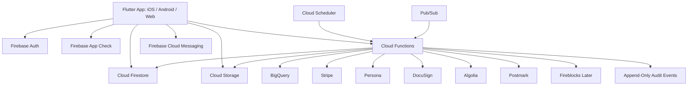

# MusicXR Technology Plan

Source strategy document: `MUSICXR_PLATFORM_PLAN.md`  
Source visual artifact: `business-doc.png`  
Planning status: opinionated first technology plan  
Prepared: 2026-06-21  

## 1. Executive Technology Decision

MusicXR should be built as a serverless, Firebase-centered platform with a single Flutter codebase for iOS, Android, and web.

The recommended stack:

- Client framework: Flutter.
- Client language: Dart.
- Backend platform: Firebase plus selected Google Cloud serverless products.
- Primary database: Cloud Firestore in native mode.
- Backend compute: Cloud Functions for Firebase, written in TypeScript.
- File storage: Cloud Storage for Firebase.
- Web hosting: Firebase Hosting for the Flutter web app.
- Identity: Firebase Authentication with Identity Platform where enterprise auth features are needed.
- Backend protection: Firebase App Check plus strict Security Rules.
- Analytics and reliability: Firebase Analytics, Crashlytics, Performance Monitoring, Remote Config, Cloud Logging, and BigQuery export.
- CI/CD: Codemagic for Flutter app-store builds, GitHub Actions for Firebase deployments, Firebase Hosting preview channels for web review.
- Design foundation: a custom MusicXR design system built on Flutter Material 3 tokens, not a generic template.

Why this direction:

- Flutter directly matches the requirement to build once and publish to app stores and web.
- Firebase directly matches the requirement for serverless infrastructure and Firestore.
- Firestore gives realtime updates, offline behavior, and fast iteration for asset browsing, dashboards, review queues, portfolio views, and notifications.
- Cloud Functions keeps privileged operations off the client, especially ledger writes, payments, compliance state changes, webhooks, royalty calculations, and admin approvals.
- The design system can be polished and custom without splitting iOS, Android, and web into separate UI implementations.

The key architectural rule:

> Clients may request actions, but Cloud Functions must execute trusted actions.

That means the Flutter app can read appropriate Firestore views and submit intents, but it should not directly write financial ledger events, KYC results, payment status, token balances, royalty allocations, transfer approvals, or admin audit records.

## 2. Official Documentation Anchors

These current official docs informed the choices in this plan:

- Flutter says it supports mobile, web, desktop, and embedded devices from a single codebase: https://flutter.dev/development
- Flutter web build and release docs: https://docs.flutter.dev/platform-integration/web/building
- Flutter app architecture recommendations: https://docs.flutter.dev/app-architecture/recommendations
- Flutter adaptive and responsive design guidance: https://docs.flutter.dev/ui/adaptive-responsive
- Flutter Material 3 design guidance: https://docs.flutter.dev/ui/design/material
- Firebase for Flutter setup: https://firebase.google.com/docs/flutter/setup
- Cloud Firestore overview: https://firebase.google.com/docs/firestore
- Cloud Firestore best practices: https://firebase.google.com/docs/firestore/best-practices
- Cloud Functions for Firebase: https://firebase.google.com/docs/functions
- Firebase Hosting: https://firebase.google.com/docs/hosting
- Firebase Authentication: https://firebase.google.com/docs/auth
- Firebase App Check: https://firebase.google.com/docs/app-check
- Firebase Local Emulator Suite: https://firebase.google.com/docs/emulator-suite
- Stripe Payments: https://docs.stripe.com/payments
- Stripe Connect: https://docs.stripe.com/connect
- Persona identity platform: https://withpersona.com/
- Fireblocks developer docs: https://developers.fireblocks.com/docs

These are planning anchors, not final compliance signoff.

## 3. Product Constraints That Shape The Technology

MusicXR is not a normal media app. It combines music discovery, rights verification, regulated onboarding, asset offerings, financial ledgers, royalty accounting, investor dashboards, marketplace behavior, and potentially blockchain settlement.

The technology must support:

- Public browsing.
- Private artist onboarding.
- KYC/KYB and investor eligibility.
- Rights document intake.
- Admin review workflows.
- Offering setup.
- Primary purchase flows.
- Token or ownership ledger tracking.
- Royalty import, allocation, and statement generation.
- Portfolio views.
- Notifications.
- Future controlled secondary transfers.
- Future marketplace pricing.
- Future wallet or custody integration.
- Strong auditability.

The platform also needs to feel beautiful. MusicXR should look like a premium music-finance product, not a crypto dashboard clone. The UI must carry the emotional pull of music while maintaining the calm precision of a regulated investment platform.

## 4. Why Flutter Is The Best Framework

Flutter is the best choice for this platform because the user requirement is explicit: build once and publish to app stores and web.

### Flutter Strengths For MusicXR

Single product codebase:

- One shared app can target iOS, Android, and web.
- Shared UI components keep the brand coherent.
- Shared validation and form flows reduce regulatory drift between platforms.
- Shared dashboard and chart components reduce feature duplication.

High control over visual design:

- Flutter gives the team precise control over layout, typography, motion, and custom components.
- The MusicXR UI can be built as a branded design system rather than a default mobile UI.
- Artist artwork, waveform treatments, royalty charts, portfolio surfaces, and marketplace views can share one interaction language across devices.

Firebase fit:

- Flutter has direct Firebase setup paths.
- Firestore realtime listeners map well to portfolio updates, admin queues, notification counts, and marketplace snapshots.
- Firebase Authentication, App Check, Cloud Messaging, Crashlytics, and Performance Monitoring all have Flutter support paths.

App-store readiness:

- Flutter has release paths for iOS and Android.
- Codemagic is strongly aligned with Flutter build automation, signing, and TestFlight/Play delivery.

Responsive web:

- Flutter web can host the authenticated product app.
- The same route structure can support app-like web access for fans, artists, investors, and admins.

### Tradeoffs

Flutter web is not the strongest choice for public SEO-heavy content. For MusicXR, this is acceptable if the first web target is the product app, not a large editorial marketing site.

Recommended compromise:

- Build the actual MusicXR product once in Flutter.
- Host it on Firebase Hosting.
- If SEO becomes critical, add a tiny static marketing/documentation shell later, also hosted on Firebase Hosting, without duplicating authenticated product logic.

Do not start with separate React web, native iOS, and native Android apps. That would slow iteration and create three places for compliance-sensitive flows to drift.

## 5. Recommended Vendor Stack

### Core Platform

Firebase and Google Cloud:

- Firebase Authentication.
- Cloud Firestore.
- Cloud Functions for Firebase.
- Cloud Storage for Firebase.
- Firebase Hosting.
- Firebase App Check.
- Firebase Security Rules.
- Firebase Cloud Messaging.
- Firebase Analytics.
- Firebase Crashlytics.
- Firebase Performance Monitoring.
- Firebase Remote Config.
- Firebase Local Emulator Suite.
- BigQuery export.
- Cloud Logging.
- Cloud Scheduler for scheduled jobs.
- Pub/Sub for async event pipelines when workloads grow.
- Cloud Run Jobs only for heavier batch imports that do not fit cleanly in functions.

### Client Framework And App Delivery

Flutter:

- Primary app for iOS, Android, and web.
- Build all core product surfaces in one codebase.
- Use custom Material 3 theme tokens.

Codemagic:

- Mobile CI/CD for Flutter.
- Build signing.
- TestFlight release.
- Google Play internal/closed testing release.

GitHub Actions:

- Linting.
- Unit tests.
- Function tests.
- Firebase Emulator Suite tests.
- Firebase Hosting preview deploys.
- Firebase Functions deployments.

### Identity, Compliance, And Risk

Firebase Authentication with Identity Platform:

- Primary account authentication.
- MFA for admin and financial actions.
- Optional OIDC/SAML support later for enterprise partners.
- Custom claims for role and access gates.

Persona:

- KYC.
- KYB.
- Identity workflows.
- Watchlist/adverse media screening if enabled.
- Case review for exceptions.
- Good fit because MusicXR needs both individual and business verification.

Accredited investor verification:

- Add VerifyInvestor or Parallel Markets only when the offering path requires third-party accreditation review.
- Do not build accreditation review manually as an internal-only workflow unless counsel explicitly approves.

Compliance monitoring:

- Start with Persona cases, Firestore compliance event logs, and manual review queues.
- Add Sardine, Unit21, or Alloy only if fraud and AML workflows require deeper transaction monitoring.

### Payments, Payouts, And Money Movement

Stripe Payments:

- Use for non-securities payments, deposits where allowed, subscriptions, application fees, and early platform fees.
- Use Checkout where possible to reduce PCI exposure.

Stripe Connect:

- Use for marketplace-style payouts to rights holders only if the legal and payments model supports it.
- Good for connected account onboarding and payout workflows.

Important restriction:

- Do not assume Stripe alone can support securities offerings, escrow, broker-dealer flows, or regulated investment settlement. If MusicXR offers securities, counsel should select the regulated rails, escrow provider, broker-dealer/funding portal partner, transfer agent, or ATS partner.

Stablecoin and custody:

- Start with an internal Firestore ownership ledger and fiat payments.
- Use Fireblocks later for institutional custody, treasury wallets, tokenization support, policy controls, transaction approvals, and on-chain settlement.
- Do not expose unrestricted self-custody in MVP.

### Documents And Agreements

DocuSign:

- Rights holder agreements.
- Artist authorization agreements.
- Investor subscription documents if approved by counsel.
- Administrative approvals where e-signature matters.

Cloud Storage for Firebase:

- Store uploaded rights documents, royalty statements, IDs only if permitted by identity vendor flow, signed PDFs, and generated statements.
- Use private buckets and short-lived signed URLs from Cloud Functions.

### Search And Discovery

Algolia:

- Use for asset discovery, artist search, catalog search, and eventually marketplace search.
- Firestore is not a full-text search engine.
- Cloud Functions should sync approved public asset documents into Algolia indexes.

### Notifications And Messaging

Firebase Cloud Messaging:

- Push notifications across iOS, Android, and web.

Postmark:

- Transactional email such as KYC status, purchase receipts, rights review updates, royalty statements, and admin alerts.

Twilio:

- SMS only for high-value flows where SMS is actually needed.
- Avoid using SMS as the only second factor for admins if stronger MFA is available.

### Support And Operations

Zendesk:

- Support ticketing.
- User issues.
- Compliance-sensitive support workflows.
- Better operational fit than lightweight chat-only tools.

Notion or Linear:

- Internal product planning.
- Launch checklist.
- Operational runbooks.

### Observability And Analytics

Firebase Analytics:

- Baseline product analytics.

BigQuery:

- Event export.
- Royalty reporting warehouse.
- Compliance analytics.
- Investor and asset metrics.

Crashlytics:

- Mobile crash reporting.

Performance Monitoring:

- Client performance traces.

Sentry:

- Optional second layer for Flutter web and Cloud Functions exception tracking.
- Add if Firebase tooling does not provide enough cross-surface debugging detail.

## 6. High-Level Architecture



### Client Responsibilities

The Flutter client can:

- Render public asset lists.
- Render account and onboarding flows.
- Submit artist applications.
- Upload files through controlled flows.
- Start KYC/KYB sessions.
- Submit purchase intents.
- Display portfolio balances.
- Display royalty statements.
- Display admin review queues to authorized users.
- Request signed URLs for private documents.
- Listen to realtime status updates.

The Flutter client cannot:

- Mark KYC as passed.
- Mark payment as settled.
- Write ledger events directly.
- Change token balances directly.
- Approve rights verification directly without a Cloud Function audit path.
- Finalize royalty allocation directly.
- Override transfer restrictions.
- Create signed document URLs without backend authorization.

### Backend Responsibilities

Cloud Functions can:

- Validate user role and custom claims.
- Receive vendor webhooks.
- Create Stripe sessions.
- Handle Stripe payment status.
- Create Persona inquiries.
- Handle Persona status webhooks.
- Create DocuSign envelopes.
- Sync Algolia search indexes.
- Parse royalty imports.
- Allocate distributions.
- Append ledger events.
- Update balance projections.
- Generate holder statements.
- Enforce transfer rules.
- Write audit events.
- Send transactional emails.
- Send push notifications.

## 7. Firebase Project Layout

Use separate Firebase projects:

- `musicxr-dev`
- `musicxr-staging`
- `musicxr-prod`

Why:

- Avoid test data touching production.
- Keep App Check, KYC, payment, and webhook environments separate.
- Allow preview channels and safe QA.
- Preserve production audit integrity.

Recommended app targets:

- `com.musicxr.app.dev`
- `com.musicxr.app.staging`
- `com.musicxr.app`
- `musicxr-dev.web.app`
- `staging.musicxr.com`
- `app.musicxr.com`

Do not store secrets in Flutter clients. Public Firebase config values can live in client builds, but vendor secrets, service account credentials, webhook secrets, API keys with privilege, and signing secrets belong only in Google Secret Manager or protected CI/CD configuration.

## 8. Firestore Data Architecture

Firestore should be treated as the product database, realtime status layer, and read-optimized app state store. It should not be treated like a relational database.

Use:

- Denormalized read models for app screens.
- Append-only ledgers for financial history.
- Cloud Functions for trusted mutations.
- Security Rules for client-side access boundaries.
- BigQuery for reporting and heavy analytics.
- Cloud Storage for large documents and files.

### Core Collections

Recommended top-level collections:

- `users`
- `userPrivate`
- `artistProfiles`
- `rightsHolderEntities`
- `assets`
- `assetPublicCards`
- `assetPrivateReviews`
- `rightsDocuments`
- `offerings`
- `orders`
- `ledgerEvents`
- `balanceProjections`
- `holderSnapshots`
- `royaltyImports`
- `royaltyLineItems`
- `distributionBatches`
- `distributionStatements`
- `marketListings`
- `transferRequests`
- `complianceProfiles`
- `complianceEvents`
- `adminTasks`
- `auditEvents`
- `notifications`
- `supportCases`
- `appConfig`

### User Documents

`users/{userId}`:

- Public or broadly readable app identity.
- Display name.
- Avatar.
- User type flags.
- Onboarding status summary.
- Created timestamp.

`userPrivate/{userId}`:

- Email.
- Phone.
- Legal name summary.
- Tax profile status.
- Payment profile status.
- KYC provider reference.
- KYB provider reference.
- Risk status.
- Sensitive status metadata.

Access:

- User can read limited own private document.
- Admins can read through role-gated rules.
- Cloud Functions perform writes.

### Artist And Rights Holder Documents

`artistProfiles/{artistId}`:

- User or entity owner.
- Artist name.
- Bio.
- Links.
- Artwork.
- Public status.
- Review status.

`rightsHolderEntities/{entityId}`:

- Entity type.
- Legal name.
- Verification status.
- KYB provider reference.
- Signatory users.
- Admin review status.

### Asset Documents

`assets/{assetId}`:

- Canonical asset record.
- Asset type.
- Title.
- Artist ID.
- Rights holder entity ID.
- ISRC/ISWC where applicable.
- Included royalty streams.
- Excluded royalty streams.
- Rights status.
- Offering readiness.
- Risk rating.
- Created by.
- Approved by.
- Timestamps.

`assetPublicCards/{assetId}`:

- Denormalized public view.
- Title.
- Artist.
- Artwork.
- Asset type.
- Public summary.
- Offering status.
- Performance teaser if approved.
- Search tags.

`assetPrivateReviews/{assetId}`:

- Internal checklist.
- Verification notes.
- Counsel notes.
- Document references.
- Risk flags.
- Decision history.

### Rights Documents

`rightsDocuments/{documentId}`:

- Asset ID.
- Entity ID.
- Storage path.
- Document type.
- Uploaded by.
- Review status.
- Hash.
- Version.
- Created timestamp.

The file itself lives in Cloud Storage. Firestore stores metadata and review state.

### Offerings

`offerings/{offeringId}`:

- Asset ID.
- Issuer ID.
- Token class.
- Total supply.
- Offered amount.
- Retained amount.
- Price.
- Currency.
- Minimum purchase.
- Maximum purchase.
- Eligibility rule set.
- Transfer restriction rule set.
- Disclosure document references.
- Start and end dates.
- Status.

Use subcollections only when lifecycle and access patterns require it:

- `offerings/{offeringId}/disclosureAcknowledgements/{userId}`
- `offerings/{offeringId}/updates/{updateId}`

### Orders

`orders/{orderId}`:

- User ID.
- Offering ID.
- Asset ID.
- Quantity.
- Price.
- Currency.
- Status.
- Payment provider.
- Payment reference.
- Eligibility snapshot.
- Disclosure acknowledgement snapshot.
- Created timestamp.
- Settled timestamp.

Order states:

- `draft`
- `pendingEligibility`
- `pendingPayment`
- `paymentProcessing`
- `settled`
- `failed`
- `cancelled`
- `refunded`
- `manualReview`

### Ledger Events

`ledgerEvents/{ledgerEventId}`:

- Event type.
- User ID.
- Asset ID.
- Offering ID.
- Token class.
- Quantity delta.
- Source order ID.
- Source transfer ID.
- Source distribution ID.
- Effective timestamp.
- Created by function.
- Reversal reference if applicable.

Rules:

- Append only.
- Never client writable.
- Corrections use reversal events.
- Balance projections are derived from ledger events.

### Balance Projections

`balanceProjections/{userId_assetId_tokenClass}`:

- User ID.
- Asset ID.
- Token class.
- Quantity.
- Locked quantity.
- Available quantity.
- Last ledger event ID.
- Updated timestamp.

These are read models for fast portfolio screens.

### Royalty Imports

`royaltyImports/{importId}`:

- Source.
- Uploaded by.
- Asset match status.
- Gross amount.
- Currency.
- Period.
- File reference.
- Parse status.
- Reconciliation status.
- Created timestamp.

`royaltyLineItems/{lineItemId}`:

- Import ID.
- Asset ID.
- Track ID.
- Source.
- Territory.
- Period.
- Gross.
- Deductions.
- Net.
- Currency.
- Match confidence.

### Distribution Batches

`distributionBatches/{batchId}`:

- Asset ID.
- Period.
- Holder snapshot ID.
- Net distributable amount.
- Status.
- Approved by.
- Payment rail.
- Created timestamp.

`distributionStatements/{statementId}`:

- Batch ID.
- User ID.
- Asset ID.
- Ownership percentage.
- Net amount.
- Currency.
- Payment status.
- Statement PDF path.

### Compliance Events

`complianceEvents/{eventId}`:

- User ID.
- Entity ID.
- Asset ID if applicable.
- Provider.
- Event type.
- Status.
- Risk level.
- Source reference.
- Created timestamp.
- Visibility.

### Audit Events

`auditEvents/{eventId}`:

- Actor user ID.
- Actor role.
- Action.
- Resource type.
- Resource ID.
- Before summary.
- After summary.
- Request ID.
- IP hash if appropriate.
- User agent summary.
- Created timestamp.

Audit events should be immutable. Sensitive fields should be summarized or hashed rather than copied wholesale.

## 9. Firestore Modeling Rules

1. Design screens first, then collections.
   Firestore performs best when data is shaped for known access patterns.

2. Keep public and private read models separate.
   Do not rely on client filtering to hide sensitive fields.

3. Never use the client for trusted financial writes.
   Client writes purchase intents. Functions settle the ledger.

4. Use denormalization intentionally.
   Asset cards, portfolio rows, admin queues, and notifications should be read-optimized.

5. Use append-only records for money and ownership.
   Orders, ledger events, royalty allocations, and audit events need durable history.

6. Avoid write hotspots.
   Do not update a single global counter or one busy sequential document during high traffic.

7. Use generated document IDs for high-write collections.
   Avoid sequential IDs for hot paths.

8. Keep long text and large arrays out of indexed query paths.
   Use indexing exemptions where appropriate.

9. Export or mirror analytical data to BigQuery.
   Do not make Firestore perform warehouse workloads.

10. Treat subcollections as lifecycle boundaries.
   Use them when child records belong to a parent workflow, not as a default.

## 10. Security Model

MusicXR needs security controls that assume real money, private identity data, confidential rights documents, and investor records.

### Authentication

Use Firebase Authentication as the base:

- Email/password.
- Email link optional.
- Sign in with Apple.
- Google sign-in.
- MFA for admins and financial actions.
- Custom claims for roles.

User roles:

- `fan`
- `investor`
- `artist`
- `rightsHolder`
- `adminOps`
- `adminCompliance`
- `adminFinance`
- `adminSuper`
- `legalReviewer`

Role claims should be compact. Detailed permissions should also be stored in Firestore and resolved by Cloud Functions for sensitive actions.

### App Check

Enable Firebase App Check:

- Apple App Attest or DeviceCheck for iOS.
- Play Integrity for Android.
- reCAPTCHA Enterprise for web.
- Enforce App Check for Firestore, Storage, and callable Functions once tested.

App Check reduces unauthorized client abuse. It does not replace Authentication, Security Rules, rate limits, or fraud detection.

### Firestore Security Rules

Rules principles:

- Default deny.
- Public read only for approved public read models.
- Users read their own allowed documents.
- Admin reads are role gated.
- Financial writes are Functions only.
- Compliance writes are Functions only.
- Storage access is mediated by document metadata and signed URLs.

Example policy shape:

```text
Clients can write:
- onboarding drafts they own
- asset submission drafts they own
- purchase intent requests
- support cases
- notification read receipts

Clients cannot write:
- KYC result
- KYB result
- payment result
- order settlement
- ledger events
- balance projections
- distribution batches
- audit events
- admin review final decisions without function path
```

### Storage Rules

Storage buckets:

- Public media bucket for approved artwork and public assets.
- Private rights document bucket.
- Private royalty statement bucket.
- Private generated statement bucket.

Rules:

- Public media can be read publicly only after approval.
- Rights documents are never public.
- Royalty statements are never public.
- Uploads go through controlled paths.
- Downloads for private files use short-lived signed URLs generated by Cloud Functions.

### Secrets

Use Google Secret Manager for:

- Stripe secret keys.
- Stripe webhook secrets.
- Persona API keys.
- Persona webhook secrets.
- DocuSign credentials.
- Postmark tokens.
- Algolia admin keys.
- Fireblocks API credentials.

Do not expose privileged vendor keys in Flutter or Firebase public config.

## 11. Cloud Functions Architecture

Use TypeScript Cloud Functions with a domain-first structure.

Recommended folders:

```text
functions/
  src/
    app/
      callable/
      http/
      scheduled/
      triggers/
    domains/
      identity/
      artists/
      rights/
      assets/
      offerings/
      orders/
      ledger/
      royalties/
      distributions/
      marketplace/
      compliance/
      notifications/
      documents/
      search/
      support/
      audit/
    shared/
      auth/
      firestore/
      validation/
      vendors/
      logging/
      errors/
```

### Function Types

Callable functions:

- Authenticated app actions.
- Create KYC session.
- Create purchase intent.
- Request private document URL.
- Approve admin workflow step.

HTTPS functions:

- Vendor webhooks.
- Stripe webhook.
- Persona webhook.
- DocuSign webhook.
- Fireblocks webhook later.

Firestore triggers:

- Create public read model when asset approved.
- Sync search index.
- Send notifications on status changes.
- Update denormalized dashboard counters.

Scheduled functions:

- Royalty import reminders.
- Distribution reconciliation checks.
- Stale order cleanup.
- Compliance recheck queues.

Pub/Sub functions:

- High-volume async processing later.
- Royalty import parsing.
- Batch statement generation.
- Search indexing retries.

### Function Design Standards

- Validate all inputs with a schema library.
- Resolve user permissions server-side.
- Write audit events for admin and financial actions.
- Use idempotency keys for webhooks and settlement.
- Use transactions for order settlement and ledger appends.
- Make every vendor webhook safe to retry.
- Keep function logs structured.
- Keep PII out of logs.
- Return clear error codes to the client.

## 12. Trusted Workflow Examples

### KYC Workflow

1. User starts onboarding in Flutter.
2. Flutter calls `createPersonaInquiry`.
3. Cloud Function creates Persona inquiry and stores provider reference.
4. User completes Persona flow.
5. Persona sends webhook to Cloud Function.
6. Function verifies webhook signature.
7. Function writes compliance event.
8. Function updates user compliance summary.
9. Function updates onboarding status.
10. Flutter receives realtime status update from Firestore.

### Primary Purchase Workflow

1. User opens approved asset offering.
2. Flutter loads public offering read model.
3. User acknowledges disclosures.
4. Flutter calls `createPurchaseIntent`.
5. Function checks KYC, eligibility, offering status, limits, jurisdiction, and lockup rules.
6. Function creates order.
7. Function creates Stripe Checkout session or regulated payment session.
8. User completes payment.
9. Payment provider sends webhook.
10. Function verifies webhook.
11. Function settles order in Firestore transaction.
12. Function appends ledger event.
13. Function updates balance projection.
14. Function writes audit event.
15. Function sends receipt.
16. Flutter portfolio updates through Firestore listener.

### Royalty Distribution Workflow

1. Admin uploads royalty statement.
2. Cloud Storage finalize event triggers parse job.
3. Function creates royalty import and line item records.
4. Admin reviews match confidence and deductions.
5. Admin approves allocation preview.
6. Function snapshots eligible holders.
7. Function calculates distribution amounts.
8. Function creates distribution batch.
9. Finance/admin approves release.
10. Function initiates payment or records manual payment status.
11. Function generates holder statements.
12. Function sends notifications.
13. Flutter displays statements and payout status.

### Rights Verification Workflow

1. Artist uploads asset metadata and rights documents.
2. Admin review queue receives task.
3. Admin marks checklist items.
4. Legal reviewer requests more information or approves.
5. Function writes review decision and audit event.
6. Asset status moves to `verified`.
7. Public asset card can be generated only after approval.

## 13. App Architecture

Use Flutter's recommended separation of concerns:

- UI layer.
- Application layer.
- Data layer.
- Repository abstractions.
- Service classes.
- View models/controllers.

Recommended package choices:

- State management: Riverpod.
- Routing: go_router.
- Data models: Freezed plus json_serializable.
- Firebase: FlutterFire packages.
- Forms: reactive form pattern or custom validated form controllers.
- Charts: Syncfusion Flutter Charts for polished financial/data visualization, subject to license review.
- Animation: Rive for branded motion; Lottie only for simpler one-shot animation.
- Local secure storage: flutter_secure_storage for tokens or local secrets that must not live in plain preferences.
- Local simple preferences: shared_preferences for non-sensitive UI preferences.

Suggested app folder:

```text
app/
  lib/
    main.dart
    app/
      bootstrap.dart
      router.dart
      theme/
      config/
    core/
      auth/
      errors/
      logging/
      money/
      dates/
      permissions/
      widgets/
    features/
      onboarding/
      discover/
      assets/
      artist_portal/
      rights_review/
      offerings/
      purchase/
      portfolio/
      royalties/
      marketplace/
      wallet/
      notifications/
      admin/
      support/
    data/
      repositories/
      firebase/
      functions/
      models/
```

### App Targets

One Flutter app can still have different entry states:

- Public discovery.
- Fan/investor app.
- Artist portal.
- Admin console.

Recommendation:

- Start with one Flutter codebase.
- Use role-aware routing.
- Keep admin screens in the same codebase during MVP to move fast.
- Split admin into a separate Firebase Hosting site later only if security review, bundle size, or release cadence demands it.

## 14. Route Map

Public:

- `/`
- `/discover`
- `/assets/:assetId`
- `/artists/:artistId`
- `/education`
- `/apply`
- `/waitlist`

Auth:

- `/sign-in`
- `/create-account`
- `/verify-email`
- `/mfa`

Onboarding:

- `/onboarding`
- `/onboarding/identity`
- `/onboarding/investor-profile`
- `/onboarding/payment-profile`
- `/onboarding/status`

Artist:

- `/artist`
- `/artist/assets`
- `/artist/assets/new`
- `/artist/assets/:assetId`
- `/artist/royalties`
- `/artist/documents`

Investor/fan:

- `/app`
- `/app/discover`
- `/app/assets/:assetId`
- `/app/offerings/:offeringId`
- `/app/portfolio`
- `/app/portfolio/:assetId`
- `/app/royalties`
- `/app/statements/:statementId`
- `/app/wallet`

Marketplace later:

- `/app/market`
- `/app/market/:assetId`
- `/app/transfers`

Admin:

- `/admin`
- `/admin/assets`
- `/admin/assets/:assetId/review`
- `/admin/entities`
- `/admin/compliance`
- `/admin/orders`
- `/admin/royalties`
- `/admin/distributions`
- `/admin/support`
- `/admin/audit`

## 15. UI And Design System

MusicXR should look like music culture and institutional finance met on good terms.

It should not look like:

- A generic NFT marketplace.
- A neon crypto casino.
- A beige SaaS admin template.
- A dense brokerage screen with no soul.
- A festival landing page with no operational trust.

### Design Personality

Keywords:

- Premium.
- Electric.
- Trustworthy.
- Musical.
- Precise.
- Liquid.
- Legible.
- Calm under complexity.

Visual metaphor:

- Sound waves, ledgers, ownership graphs, album art, and market depth.

### Palette

Use a broad but disciplined palette:

- Ink: near-black base for immersive music surfaces.
- Charcoal: admin and dashboard panels.
- White: primary text and contrast.
- Electric cyan: active data, verified states, key focus.
- Signal violet: brand accent and music energy.
- Royal magenta: marketplace and secondary activity.
- Gold: value, equity, verified rights, premium moments.
- Green: success and payout completion.
- Amber: review or pending states.
- Red: blocked, failed, or high-risk compliance states.

Avoid a one-note purple/blue gradient system. Purple can be part of the identity, but the product needs a wider financial-status vocabulary.

### Typography

Use a refined, readable type system:

- Display: strong geometric sans for brand moments.
- UI: highly legible sans for dense forms and dashboards.
- Numeric: tabular figures for prices, royalties, percentages, and token quantities.

Rules:

- No negative letter spacing.
- No viewport-scaled font sizes.
- Large display text only for true hero or brand surfaces.
- Compact panels use compact headings.
- Buttons must not resize or wrap awkwardly across breakpoints.

### Layout Principles

Mobile:

- Bottom navigation for main user app.
- Stepper flows for onboarding and purchase.
- One primary action per screen.
- Asset cards with artwork, title, status, and one key metric.
- Portfolio as stacked holdings with expandable detail.

Tablet:

- Two-column asset and portfolio layouts.
- Persistent contextual side panels in admin/review flows.
- More chart detail without overcrowding.

Desktop/web:

- Side navigation for app and admin.
- Data-dense but breathable dashboards.
- Split view for review queues.
- Sticky action bars for review and purchase flows.
- Wide charts and statement tables.

### Core Components

Foundation:

- `MxAppShell`
- `MxTopBar`
- `MxSideNav`
- `MxBottomNav`
- `MxPageHeader`
- `MxSection`
- `MxActionBar`
- `MxEmptyState`
- `MxErrorState`
- `MxLoadingState`

Identity and compliance:

- `IdentityStatusBadge`
- `EligibilityGate`
- `KycProgressStepper`
- `RiskDisclosurePanel`
- `ComplianceHoldBanner`
- `AdminDecisionTrail`

Assets:

- `AssetCard`
- `AssetHero`
- `AssetPerformanceChart`
- `RightsVerifiedBadge`
- `RoyaltyStreamList`
- `OfferingSummaryPanel`
- `ArtistIdentityStrip`

Purchase:

- `PurchaseStepper`
- `DisclosureAcknowledgement`
- `TokenQuantityInput`
- `PaymentMethodPanel`
- `OrderReviewPanel`
- `SettlementReceipt`

Portfolio:

- `PortfolioSummary`
- `HoldingRow`
- `HoldingDetailSheet`
- `RoyaltyStatementCard`
- `DistributionTimeline`
- `WalletBalancePanel`

Marketplace later:

- `PriceChart`
- `OrderBook`
- `BidAskSpread`
- `TradeHistory`
- `TransferRestrictionExplainer`
- `MarketPauseBanner`

Admin:

- `ReviewQueue`
- `RightsChecklist`
- `DocumentViewer`
- `ReviewNotesPanel`
- `ApprovalControls`
- `AuditTimeline`
- `DistributionBatchTable`
- `RoyaltyImportMapper`

### UI States

Every meaningful surface must design:

- Loading.
- Empty.
- Error.
- Permission denied.
- Pending review.
- Blocked by compliance.
- Offline or degraded network.
- Success.
- Partial success.
- Requires manual support.

### Motion

Use motion sparingly:

- Subtle waveform animation on asset hero.
- Smooth step transitions during onboarding.
- Portfolio number transitions for status updates.
- Rive brand mark for launch/loading moments.
- Reduced-motion mode must disable decorative animation.

### Accessibility

Minimum standard:

- WCAG AA contrast.
- Full keyboard navigation on web.
- Screen-reader labels for financial values and status badges.
- Large tap targets.
- Reduced motion.
- Clear focus states.
- Error text associated with form inputs.
- No color-only status communication.

## 16. Screen-Level Design Direction

### Public Home

Purpose:

- Establish MusicXR as a trusted music asset platform.
- Drive artist applications and fan/investor waitlist.

Design:

- Full-bleed real or generated music/artist visual.
- Brand name visible in first viewport.
- A hint of the next section visible.
- No generic gradient-only hero.
- Supporting copy should emphasize verified music assets, royalty participation, and compliant infrastructure.

### Discover

Purpose:

- Let users browse verified assets.

Design:

- Artwork-led asset cards.
- Filters for asset type, genre, offering status, rights status, and performance band.
- Search powered by Algolia.
- Cards should show only approved, non-misleading data.

### Asset Detail

Purpose:

- Convert interest into trust.

Design:

- Artist artwork and track/catalog identity.
- Rights verification status.
- Included royalty streams.
- Historical performance chart if approved.
- Offering terms.
- Fees.
- Risks.
- Purchase CTA gated by eligibility.

### Artist Onboarding

Purpose:

- Help rights holders submit usable, reviewable assets.

Design:

- Clear stepper.
- Save drafts automatically.
- Upload checklist.
- Plain-language rights questions.
- Review status timeline.
- No intimidating legal wall at the first step.

### Investor Onboarding

Purpose:

- Get users verified without making the product feel cold.

Design:

- Explain why information is needed.
- Show status and next step.
- Use embedded vendor flows where possible.
- Keep identity steps visually distinct from investment decision steps.

### Portfolio

Purpose:

- Show ownership and income clearly.

Design:

- Holdings summary.
- Total portfolio value where reliable.
- Royalty distributions.
- Pending payouts.
- Asset-level detail.
- Restriction/lockup status.
- Statement downloads.

### Admin Review

Purpose:

- Let operators make careful decisions efficiently.

Design:

- Split pane: queue, asset detail, documents, checklist, notes.
- Clear status tags.
- No nested cards inside cards.
- Sticky decision controls.
- Audit trail always visible.

### Royalty Operations

Purpose:

- Reconcile money without spreadsheet chaos.

Design:

- Import status.
- Match confidence.
- Exceptions first.
- Batch preview.
- Before/after totals.
- Approval controls.
- Holder statement preview.

## 17. Serverless API Boundary

Do not build a traditional REST API for everything.

Use:

- Firestore direct client reads for safe read models.
- Firestore listeners for realtime updates.
- Callable Cloud Functions for authenticated commands.
- HTTPS Cloud Functions for vendor webhooks.
- Scheduled Functions for timed jobs.
- Pub/Sub for async job fan-out later.

Command examples:

- `createKycSession`
- `submitArtistAsset`
- `requestDocumentUpload`
- `requestPrivateDocumentUrl`
- `createPurchaseIntent`
- `cancelOrder`
- `approveRightsReview`
- `rejectRightsReview`
- `approveDistributionBatch`
- `requestTransfer`
- `pauseAsset`

Read model examples:

- `assetPublicCards`
- `portfolioSummary`
- `balanceProjections`
- `distributionStatements`
- `notifications`
- `adminTasks`

## 18. Data Privacy Plan

MusicXR will handle sensitive personal, financial, and rights data.

### Data Classification

Public:

- Approved artist profile.
- Approved asset card.
- Approved public offering summary.
- Public education content.

User private:

- Contact info.
- User onboarding status.
- Portfolio holdings.
- Royalty statements.
- Payment profile status.

Restricted compliance:

- KYC/KYB provider references.
- Compliance events.
- Risk flags.
- Watchlist status.
- Investor eligibility details.

Highly restricted:

- Rights contracts.
- Royalty statements.
- Tax identifiers.
- Identity documents if stored at all.
- Payment settlement references.
- Admin legal notes.

### Storage Principle

Store the minimum needed:

- Prefer vendor-hosted identity documents rather than copying them into MusicXR.
- Store provider references and status summaries.
- Store rights documents because the platform needs them for review and audit.
- Store hashes and metadata for file integrity.
- Keep sensitive files private and access-controlled.

## 19. Marketplace And Ledger Technology

The first version should not be on-chain by default.

Recommended MVP:

- Firestore ledger events as the system of record.
- Cloud Functions as the only writer.
- Balance projections for portfolio reads.
- No external transfers.
- No public blockchain dependency.

Why:

- Faster MVP.
- Easier correction workflow.
- Easier compliance gating.
- Less custody risk.
- Better app-store acceptance posture.

Later:

- Add Fireblocks for custody and tokenization workflows.
- Add on-chain minting only after securities, transfer, custody, and tax path is approved.
- Keep Firestore as the operational ledger even if chain settlement is added.
- Treat blockchain transaction IDs as settlement references, not the only application state.

## 20. Royalty Processing Technology

MVP:

- Admin uploads CSV/XLSX/PDF statements.
- Store source file in Cloud Storage.
- Parse CSV/XLSX with Cloud Functions or Cloud Run Jobs.
- For PDFs, start manual review or use document extraction only after data format is understood.
- Normalize line items into Firestore.
- Export to BigQuery for reporting.
- Generate distribution preview.
- Generate PDF statements.

Later:

- Distributor API integrations.
- PRO statement integrations.
- Automated matching by ISRC/ISWC.
- FX rate integrations.
- Tax withholding logic.
- Payment automation.

Use Cloud Run Jobs when:

- Import files are large.
- Parsing takes longer than function limits.
- Batch statement generation becomes heavy.
- External API sync requires longer processing.

Cloud Run Jobs still fit the serverless goal because the team does not manage servers.

## 21. CI/CD Plan

### Branches

- `main`: production-ready.
- `develop`: integration.
- feature branches.

If the repo remains simple early, `main` plus feature branches is enough.

### Firebase Deployments

Use GitHub Actions:

- Lint functions.
- Run function unit tests.
- Run Firebase Emulator tests.
- Deploy preview Hosting channel for pull requests.
- Deploy staging on merge to `develop`.
- Deploy production after tagged release or manual approval.

### Flutter Web

Pipeline:

1. `flutter analyze`
2. `flutter test`
3. build web release.
4. deploy to Firebase Hosting preview channel.
5. run smoke tests.
6. promote to staging/prod.

### iOS And Android

Use Codemagic:

- Build dev/staging/prod flavors.
- Manage signing securely.
- Run tests.
- Upload to TestFlight.
- Upload to Google Play internal testing.
- Promote manually after QA.

### Firebase Rules

Rules should be tested in CI:

- Firestore rules tests.
- Storage rules tests.
- Emulator integration tests for common access scenarios.

## 22. Testing Strategy

Flutter:

- Unit tests for business logic.
- Widget tests for components.
- Golden tests for design system components.
- Integration tests for onboarding, purchase intent, portfolio, and admin review.

Functions:

- Unit tests for domain services.
- Emulator tests for Firestore transactions.
- Webhook tests with signed payload fixtures.
- Idempotency tests.
- Permission tests.

Security:

- Rules tests.
- Role claim tests.
- App Check enforcement review.
- Dependency scanning.
- Secret scanning.

Design QA:

- Mobile viewport screenshots.
- Tablet screenshots.
- Desktop web screenshots.
- Dark and light modes if both are supported.
- Reduced motion.
- Large text.
- Keyboard navigation.

Financial correctness:

- Ledger event tests.
- Balance projection tests.
- Royalty allocation tests.
- Rounding tests.
- Reversal/correction tests.
- Batch approval tests.

## 23. Design QA Gates

Before any release, MusicXR should pass these UI gates:

- No text clipping in buttons, chips, cards, or tables.
- No overlapping UI at mobile, tablet, or desktop widths.
- All critical actions have loading, success, and failure states.
- Financial numbers use tabular figures.
- Status colors have text/icons, not color alone.
- Onboarding forms preserve progress.
- Asset pages remain credible when data is sparse.
- Admin screens stay readable with long artist names, long legal names, and many documents.
- Charts remain legible without needing hover-only interactions.
- All screens have professional empty states.
- The app feels designed, not assembled.

## 24. Initial Implementation Roadmap

### Phase 0: Architecture And Design Foundation

Goal:

- Create the technical skeleton and visual language.

Build:

- Flutter project.
- Firebase projects: dev/staging/prod.
- Firebase CLI setup.
- Cloud Functions TypeScript project.
- Firestore rules.
- Storage rules.
- Emulator Suite.
- App theme tokens.
- Routing shell.
- Auth shell.
- Design system component gallery.

Exit criteria:

- Flutter web deploys to Firebase Hosting preview.
- Dev app runs on iOS simulator and Android emulator.
- Emulator Suite runs locally.
- First design system components exist.

### Phase 1: Public And Auth Foundation

Goal:

- Let users arrive, create accounts, and enter the correct onboarding path.

Build:

- Public home.
- Discover placeholder.
- Sign in/create account.
- Firebase Auth integration.
- Role-aware app shell.
- Basic user profile.
- Waitlist.
- Notification model.

Exit criteria:

- Users can sign up on web and mobile.
- User docs are created safely.
- Auth state works across routes.
- App shell adapts mobile/tablet/desktop.

### Phase 2: Artist And Rights Intake

Goal:

- Start building supply.

Build:

- Artist profile.
- Rights holder entity.
- Asset submission draft.
- Document upload.
- Admin review queue.
- Rights checklist.
- Review notes.
- Audit events.

Exit criteria:

- Artist can submit an asset.
- Admin can review and request changes.
- Documents remain private.
- Public asset card appears only after approval.

### Phase 3: Compliance Onboarding

Goal:

- Prepare users for regulated activity.

Build:

- Persona inquiry creation.
- Persona webhook handling.
- Compliance profile.
- Investor profile.
- Eligibility gate.
- Admin compliance review.
- Compliance event log.

Exit criteria:

- KYC/KYB statuses flow from vendor to Firestore.
- Users see clear next steps.
- Restricted actions are blocked until status allows them.

### Phase 4: Offering And Purchase Intent

Goal:

- Prove primary purchase workflow without overbuilding trading.

Build:

- Offering setup.
- Asset offering page.
- Disclosure acknowledgement.
- Purchase intent.
- Stripe test checkout or regulated payment placeholder.
- Order lifecycle.
- Ledger event settlement.
- Balance projection.
- Portfolio view.

Exit criteria:

- Test user can complete a sandbox purchase.
- Function writes ledger event.
- Portfolio updates in realtime.
- User receives confirmation.

### Phase 5: Royalty Operations

Goal:

- Prove royalty import, allocation, and statements.

Build:

- Royalty import upload.
- Line item parser.
- Asset matching.
- Allocation preview.
- Holder snapshot.
- Distribution batch.
- Statement generation.
- Notification.

Exit criteria:

- A test royalty period can be imported.
- Distribution amounts match expected ownership.
- Holder statements are visible.

### Phase 6: App Store Readiness

Goal:

- Make the product installable and testable.

Build:

- App icons.
- Launch screens.
- Deep links.
- App privacy labels support.
- TestFlight pipeline.
- Google Play internal testing pipeline.
- Crashlytics.
- Performance Monitoring.
- App Check enforcement staged rollout.

Exit criteria:

- Web staging live.
- iOS TestFlight build available.
- Android internal test build available.
- Release checklist documented.

### Phase 7: Controlled Secondary Transfers

Goal:

- Add liquidity carefully after legal approval.

Build:

- Transfer request.
- Eligibility check.
- Holding period logic.
- Admin review.
- Ledger transfer event.
- Market listing read model.
- Asset-level transfer status.

Exit criteria:

- Transfers are impossible unless rules allow them.
- Every transfer has an audit trail.

## 25. First 30 Days Technical Workplan

Week 1:

- Create repo structure.
- Initialize Flutter app.
- Initialize Firebase projects.
- Initialize Functions project.
- Configure Emulator Suite.
- Create base theme.
- Create responsive shell.
- Create first design tokens.

Week 2:

- Add Firebase Auth.
- Add role-aware routing.
- Add Firestore base rules.
- Add user profile creation function.
- Add public landing/discover skeleton.
- Add design system gallery.

Week 3:

- Add artist profile.
- Add asset submission draft.
- Add Storage upload flow.
- Add admin review shell.
- Add audit event writer.
- Add CI for Flutter and Functions.

Week 4:

- Add Persona sandbox integration spike.
- Add asset approval/public card projection.
- Add Firebase Hosting preview deploy.
- Add first mobile CI build.
- Run design QA on mobile/tablet/desktop.

## 26. Architecture Risks And Mitigations

### Risk: Firestore Query Shape Drift

Firestore requires query-driven modeling. If the team keeps adding relational-style queries, screens may become slow or expensive.

Mitigation:

- Maintain a query catalog.
- Create denormalized read models.
- Add indexes intentionally.
- Move analytics to BigQuery.

### Risk: Sensitive Data Leakage

A single broad client read can expose private compliance or rights data.

Mitigation:

- Separate public/private collections.
- Default deny rules.
- Rules tests in CI.
- Signed URLs for private files.
- No sensitive fields in public cards.

### Risk: Financial Ledger Bugs

Bad ledger writes can cause incorrect balances.

Mitigation:

- Append-only events.
- Function-only writes.
- Idempotency keys.
- Reversal events.
- Unit tests for every ledger event type.
- Balance projection rebuild command.

### Risk: Vendor Lock-In

Firebase accelerates development but creates platform dependency.

Mitigation:

- Keep domain logic in functions and repositories.
- Use explicit data export paths.
- Export events to BigQuery.
- Keep vendor references abstracted.

### Risk: Flutter Web SEO

Flutter web is best for app-like experiences, not content-heavy SEO pages.

Mitigation:

- Use Flutter for the product.
- Add a small static marketing shell later if SEO requires it.
- Keep public asset metadata available through static or server-rendered surfaces if needed.

### Risk: Regulated Marketplace Complexity

A 24/7 order book is technically feasible but legally and operationally complex.

Mitigation:

- Build ledger and transfer restrictions first.
- Add controlled transfers before order book.
- Use counsel-approved marketplace partners if needed.

### Risk: App Store Financial Review

Apps involving digital assets, investments, or payments can receive extra scrutiny.

Mitigation:

- Keep initial app focused on education, onboarding, portfolio, and approved purchase flows.
- Use clear disclaimers.
- Avoid external wallet transfers in MVP.
- Prepare app review notes and legal support.

## 27. Decisions To Make Before Coding

Must decide:

- Final app name and bundle identifiers.
- Initial supported countries/states.
- Whether first pilot is fan collectible, royalty participation, or both.
- Whether purchase flow is sandbox-only until counsel approval.
- Whether admin stays in the main Flutter app for MVP.
- Whether to support light mode at launch or launch dark-first.
- Whether to use Stripe for MVP payments or only mock payment settlement until regulated rails are selected.
- Whether identity documents remain entirely in Persona or any copies are stored.
- Whether royalty imports start with CSV only.

Recommended default decisions:

- Launch dark-first with accessible contrast.
- Admin stays in same Flutter codebase for MVP, role-gated.
- Store identity document status only, not identity document copies.
- Start with CSV royalty imports.
- Use Stripe only for non-securities sandbox/payment tests until legal payment flow is approved.
- Keep token ownership off-chain in Firestore for MVP.

## 28. Definition Of Done For The Technology Plan

This technology direction is ready to become implementation work when:

- Firebase project structure is approved.
- Flutter is accepted as the one-codebase framework.
- Firestore event/read-model architecture is accepted.
- Vendor shortlist is accepted.
- Compliance counsel validates identity/payment/custody assumptions.
- Design direction is accepted.
- Phase 0 implementation backlog is created.

## 29. Final Recommendation

Build MusicXR with Flutter and Firebase.

Use Flutter for the one-codebase app across iOS, Android, and web. Use Firestore for realtime app state, public asset cards, onboarding status, portfolios, admin queues, and read models. Use Cloud Functions for all trusted operations. Use Cloud Storage for documents and media. Use Firebase Hosting for the web app. Use App Check, Security Rules, and strict role gates from the first sprint. Use Persona for identity, Stripe only where payment use is legally appropriate, DocuSign for agreements, Algolia for search, Postmark for transactional email, Zendesk for support, Codemagic for app-store builds, and Fireblocks later when on-chain custody or settlement becomes real.

The product should start as a beautifully designed, compliant, off-chain MusicXR operating system. Once rights verification, primary offerings, royalty accounting, and portfolio trust are working, the platform can add token settlement and secondary liquidity with much less risk.
